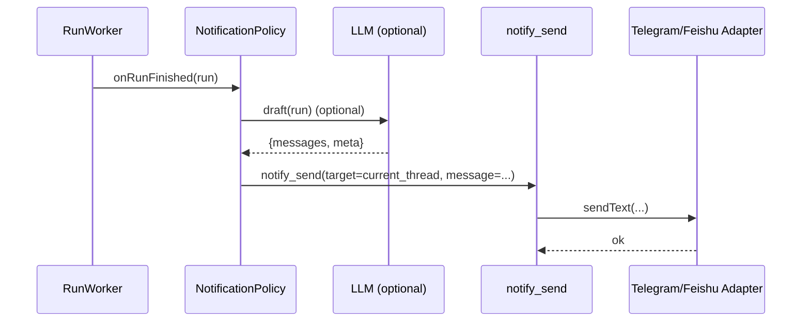
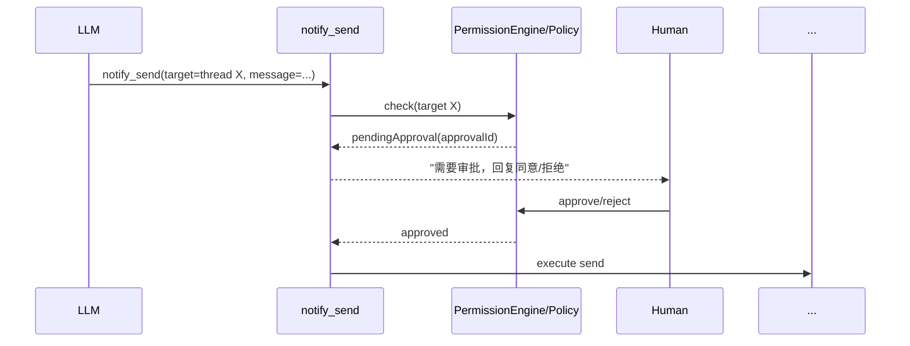

# Integrations 发送逻辑“工具化 / MCP 化”设计报告

日期：2026-02-02  
面向：ShipMyAgent core / integrations / runtime 维护者  

## 背景与问题

当前 integrations（Telegram / 飞书 / QQ 等）里不仅包含“传输层能力”（如何发、如何 reply、如何发附件），还包含大量**写死的业务消息与路由逻辑**，例如：

- run 完成通知（成功/失败、截断输出、固定前缀/格式）
- approval 提示、错误提示、usage/command 反馈等
- 不同平台的分段、Markdown/富文本容错等

这带来几个典型问题：

1) **消息策略难迭代**：每次改文案/流程都要改代码、发布版本。  
2) **无法做到“AI 决策渠道/措辞/结构”**：AI 只能生成“对话回复”，系统通知（run 完成、审批提醒）仍是模板。  
3) **新增渠道成本高**：新平台既要接入 API，又要复制一套“什么时候发什么”。  
4) **安全与可控边界不清**：发消息属于外部 side-effect，但目前与对话回复混在 adapter 里，难以统一做审批/审计/限流。

> 仓库里已有 MCP 能力与 `mcp_tool` 审批模型（见 `docs/mcp.md` 与 `package/src/runtime/agent.ts`），具备把外部能力“工具化”的基础设施。

## 设计目标（What）

把 integrations 的“发送”从“写死流程”改成“可调用能力（Tools/MCP）+ 可控编排（Policy）+ 可选 AI 生成（LLM）”：

- **Integrations 只负责 transport**：把“发消息/发附件/回复线程”等变成最小原语能力。
- **Core 负责 policy**：路由（发到哪）、权限/审批、幂等、限流、审计、失败重试。
- **LLM 负责表达**：在允许的范围内决定“发什么、怎么说、是否需要先澄清”，而不是把文案写死在代码里。

## 非目标（What not）

- 不把所有对话回复都强制改成“只能通过 send tool 发送”（这会引入重复发送/顺序问题，详见风险部分）。
- 不允许 LLM 自由指定任意收件人（跨 chat/channel 发送默认应受控/需审批）。
- 不追求一次性推翻现有实现，优先可渐进迁移。

## 总体架构（How）

推荐三层拆分：

1) **Transport Adapter（平台适配层）**
   - 只提供能力：`sendText` / `replyText` / `sendAttachment` / `resolveUser` 等
   - 平台细节：飞书 p2p vs 群聊 reply、Telegram Markdown 容错、分段、线程 message_thread_id 等

2) **Messaging Tool Layer（工具层）**
   - 把 transport 能力封装成工具（内置 tool 或 MCP tool）
   - 提供统一、强 schema 的接口：`notify.send` / `notify.reply_current` / `notify.send_file` …
   - 为 LLM 暴露 “能做什么” 而不是 “要怎么做”

3) **Policy / Orchestrator（编排与安全层）**
   - 决定工具调用是否允许、是否需要审批
   - 路由规则（同一会话的默认目标、任务触发的回推目标）
   - 限流/幂等/审计/失败重试
   - （可选）消息生成策略：模板 vs LLM（按场景/成本/风险选择）

用一句话概括：

> Adapter 提供能力；Tool 暴露能力；Policy 约束能力；LLM 在约束内决定表达。

### 关键数据结构（建议）

统一描述“要往哪发”的 Target，避免 LLM 乱填 platform 私有字段：

```ts
type NotifyTarget =
  | { kind: "current_thread" } // 当前会话（最安全，最常用）
  | { kind: "thread"; source: "telegram"|"feishu"|"qq"; threadId: string }
  | { kind: "direct"; source: "telegram"|"feishu"|"qq"; chatId: string };

type NotifyMessage =
  | { type: "text"; text: string; format?: "plain"|"markdown" }
  | { type: "rich"; blocks: unknown } // 平台差异较大，慎用
  | { type: "file"; path: string; caption?: string; mimeTypeHint?: string };
```

并统一携带审计字段：

```ts
type NotifyMeta = {
  correlationId?: string; // runId / approvalId / messageId
  reason?: string;        // 为什么要发
  visibility?: "user"|"group"|"admin";
};
```

## Tools 方案对比：内置 Tools vs MCP

### A. 内置 Tools（推荐作为第一阶段）

在 `AgentRuntime.createToolSet()` 里直接注册：
- `notify_send`
- `notify_reply_current`
- `notify_send_file`
- `notify_list_targets`（可选：让模型先查询可选目标）

优点：
- 无需额外进程/网络，部署简单
- 可以把 `needsApproval` 做成“动态”：同线程免审批，跨线程需审批
- 可直接复用现有 integrations 对象/运行态（例如 TelegramBot 实例）

缺点：
- 工具能力与 core 更耦合（但可通过接口隔离）

### B. MCP Server（推荐作为第二阶段/生态扩展）

实现一个 `shipmyagent-notify` MCP server（stdio 或 http）：
- 对外暴露 `notify.send` / `notify.send_file` 等
- core 通过 `.ship/mcp/mcp.json` 注册
- 现有代码里所有 MCP tool 默认走 `mcp_tool` 审批（已实现）

优点：
- 能把“平台发送能力”独立部署、复用到其他 agent
- 新渠道=新增 MCP server，而非改 core

缺点：
- MCP 默认需要审批（当前实现），若要“同线程免审批”需要引入更细粒度的 policy（见下一节）
- 调试链路更长（子进程/远端服务）

### 推荐路线

1) **先内置 tool** 把边界拆清楚（transport vs policy vs 文案）。  
2) 再把 tool 下沉为 **MCP server**（需要生态化/独立部署时）。

## Policy 设计（必须有）

把“能不能发、要不要审批、发到哪”从 LLM 手里拿回来，放到 policy 引擎里。

### 1) 目标路由（Route）

规则建议：
- `target.kind = current_thread`：默认允许（不需要 LLM 提供 chatId）
- run / scheduler 触发：默认发回 `run.context.source + run.context.userId/chatId`（已有约定）
- 跨线程/跨群/跨用户：必须命中 allowlist，否则拒绝或强制审批

### 2) 审批策略（Approval）

建议引入独立的 permission 类型（概念层面）：
- `notify_send`：发送消息
- `notify_send_external`：跨线程/跨用户发送

落地到现有系统有两种方式：
- 内置 tools：走 `PermissionEngine.createGenericApprovalRequest({ type: "...", ... })`
- MCP tools：复用现有 `mcp_tool`，但在 details 里标明 target/内容摘要

最小可用策略：
- `current_thread`：无需审批
- 非 `current_thread`：需要审批（或者至少需要管理员 allowlist）

### 3) 内容约束（Guardrails）

建议在执行层做强校验（而不是靠 prompt）：
- 长度上限与自动截断（不同平台不同上限）
- 链接域名 allowlist/denylist（防钓鱼与 prompt injection 扩散）
- PII 检测/脱敏（至少对 token、key、邮箱、手机号做基本规则）
- 频率限制：同 target 每分钟最多 N 条（避免循环刷屏）

### 4) 幂等与去重（Idempotency）

对“系统通知”（run 完成/审批提醒）必须带 `correlationId`：
- run 完成通知：`correlationId = runId`
- approval 提醒：`correlationId = approvalId`

policy 层维护去重存储（建议落盘，避免重启重复发送）。

## “让 AI 决定发什么”的落地方式

把消息生成从 adapter 的硬编码模板改为“可插拔策略”：

### 策略 S0：纯模板（稳定、成本低）
- 适用于：基础 ack、固定错误、help 文案
- 仍然建议把模板集中到 core（不要散在 adapter）

### 策略 S1：LLM 生成（更灵活）

适用于：
- run 完成通知的摘要（尤其是输出很长、错误复杂时）
- approval 请求摘要（用更自然的话解释风险/影响/下一步）
- 面向不同用户的语气/结构自适应（群 vs 私聊）

实现建议：
- 使用单独的 “Notification Prompt”（短系统提示词 + 强输出 schema）
- 输入：结构化 `event`（run record / approval request / task metadata）
- 输出：结构化 `NotifyMessage[]`（例如 1–3 条 text + 可选附件）
- 再由 policy 校验后调用 `notify_*` 工具执行

> 重要：LLM 只决定“内容与意图”，最终发送仍要经过 policy 校验与审计。

## 典型流程（示例）

### 1) run 完成 → 自动通知当前对话



### 2) 需要跨群发送 → 触发审批



## 与现有代码的对齐点（基于当前仓库）

- MCP 已存在：`.ship/mcp/mcp.json` + `AgentRuntime.initializeMcp()` + MCP 默认审批（`mcp_tool`）
- permission/approval 已存在：`PermissionEngine` 支持 generic approval + meta 路由字段
- integrations 已有“系统通知”雏形：Telegram 里 `notifyCompletedRuns()` 属于典型的“硬编码通知”

这意味着迁移可以从最痛点开始：先把 `notifyCompletedRuns()` 与 approval 提示的文本生成抽到统一层。

## 渐进迁移计划（建议）

### Phase 1：抽出统一通知 API（不改 LLM）
1) 建立 `NotificationService`（core）：
   - `notifyRunFinished(run)`
   - `notifyApprovalRequested(approval)`
   - `notifyError(context, error)`
2) Telegram/Feishu adapter 只调用 `NotificationService`，不拼文案。

### Phase 2：工具化发送（内置 tools）
1) 在 runtime 注册 `notify_send` 等工具，policy 做动态审批。  
2) `NotificationService` 改为调用工具（而非直接 adapter 方法）。  

### Phase 3：LLM 生成内容（可选开关）
1) `NotificationService` 增加 `messageStrategy = template | llm` 配置  
2) 对 run/approval 场景启用 LLM 摘要，保留模板兜底  

### Phase 4：MCP 化（可选）
1) 将 `notify_*` 下沉为 MCP server  
2) core 只保留 policy + 路由 + 审计  

## 风险与对策

1) **重复发送 / 顺序乱**：如果强制 LLM 对当前对话也用 send tool，容易出现“工具发送 + adapter 再发送最终回复”双发。  
   - 对策：默认仍由 adapter 发送“最终回复”；tools 仅用于旁路通知/跨线程消息；或引入“只要调用过 notify_reply_current 就不再发送最终回复”的硬规则。

2) **刷屏/死循环**：LLM 调用 notify 工具触发新消息，再触发新一轮 agent 处理。  
   - 对策：系统消息标记 `meta.from=system_notify`，inbound 侧忽略；并做速率限制与 correlationId 去重。

3) **越权发送**：LLM 猜测 chatId/channelId。  
   - 对策：目标必须来自 allowlist 或 `current_thread`；跨线程一律审批。

4) **成本与稳定性**：所有通知都走 LLM 会增加成本与不可预测性。  
   - 对策：分层策略（模板为主、LLM 为辅），只对“长输出/复杂错误”启用 LLM 摘要。

## 需要你拍板的几个决策点

1) “AI 决定发什么”的范围：仅系统通知（run/approval）？还是也包括 command/usage 文案？  
2) 允许 AI 发送到哪里：仅 current_thread？是否允许同项目内跨群/跨用户？  
3) 审批 UX：跨线程发送是否一律审批？是否支持管理员 allowlist 免审批？  
4) 是否需要 MCP 化：你更看重“生态扩展/独立部署”，还是“快速落地/调试简单”？

