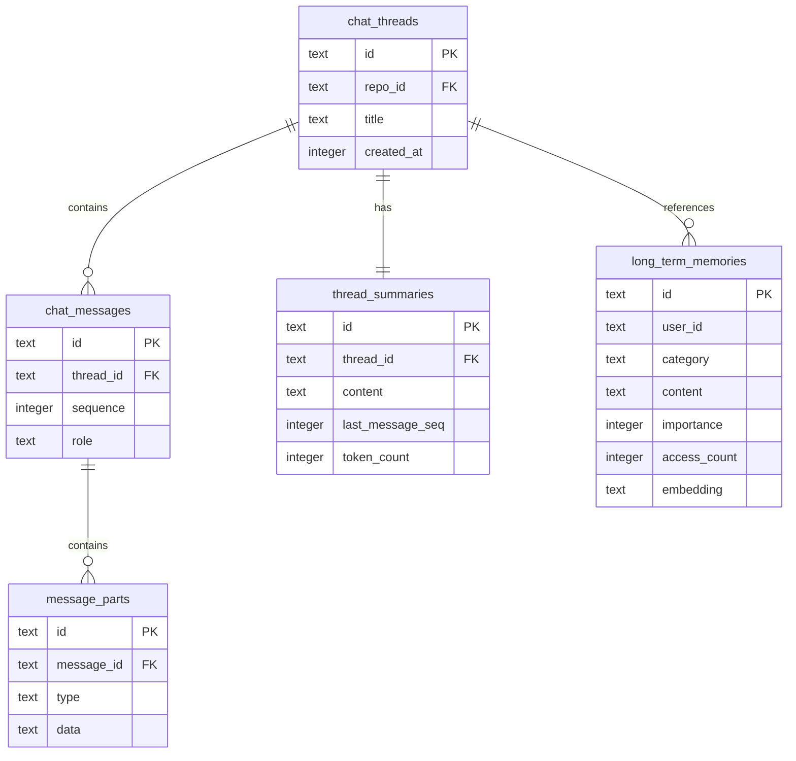
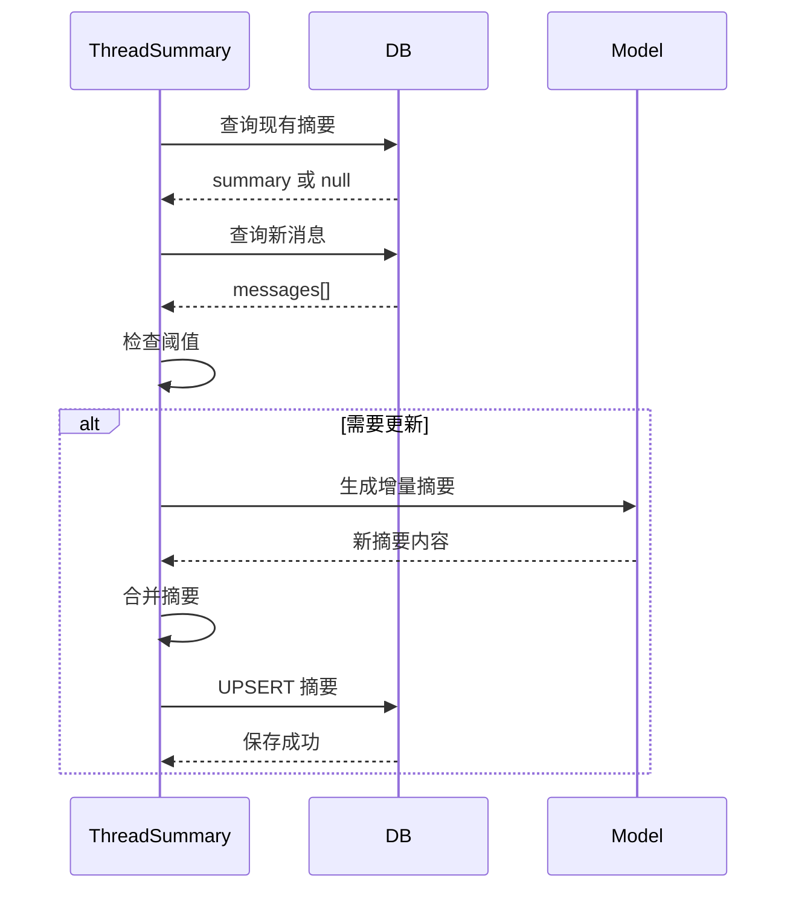
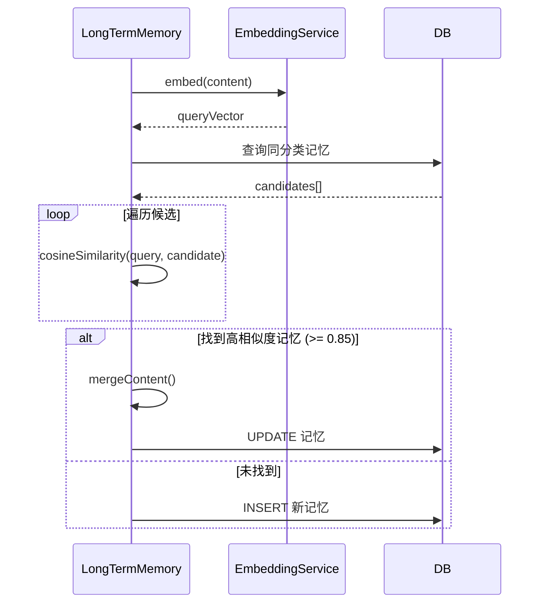
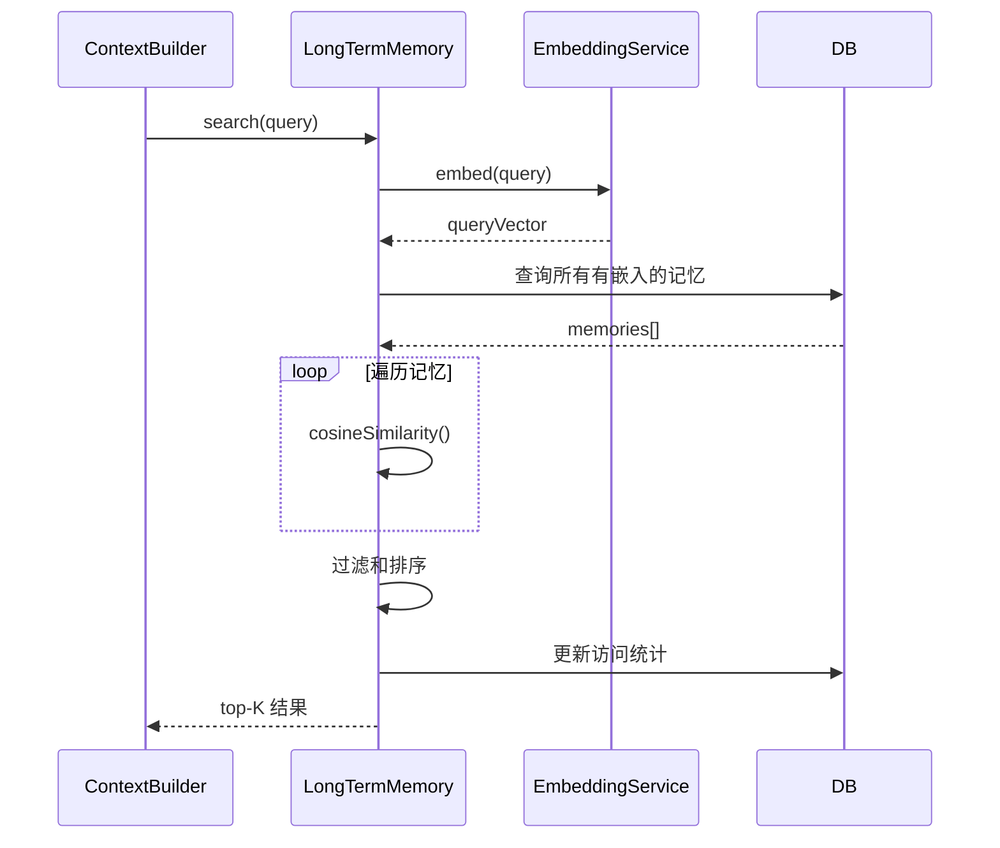

# Context 数据模型

## 概述

Context 系统的数据存储在 `chat.db` 中，包括会话摘要、长期记忆和工作记忆等。这些数据共同构成了 AI 的"记忆系统"。

## 数据库模型

### thread_summaries 表

会话摘要存储在 `chat.db` 的 `thread_summaries` 表中：

```sql
-- 位置: ~/vibecape/chat.db

CREATE TABLE thread_summaries (
  id TEXT PRIMARY KEY,           -- 摘要 ID
  thread_id TEXT NOT NULL,       -- 关联的会话 ID
  content TEXT NOT NULL,         -- 摘要内容
  last_message_seq INTEGER NOT NULL, -- 已摘要到的消息序列号
  token_count INTEGER NOT NULL,  -- 摘要的 Token 数
  created_at INTEGER NOT NULL,   -- 创建时间
  updated_at INTEGER NOT NULL,   -- 更新时间
  UNIQUE(thread_id)
);
```

**字段说明：**

- `id`：摘要的唯一标识符（24 字符，nanoid 生成）
- `thread_id`：关联的聊天线程 ID
- `content`：摘要的文本内容
- `last_message_seq`：已摘要到的最后一条消息的序列号
- `token_count`：摘要内容的估算 Token 数
- `created_at`：创建时间戳
- `updated_at`：最后更新时间戳

**TypeScript 类型定义：**

```typescript
// package/src/common/schema/chat.ts

export const threadSummaries = sqliteTable("thread_summaries", {
  id: id("id", { length: 24 }),
  thread_id: text("thread_id")
    .notNull()
    .references(() => chatThreads.id),
  content: text("content").notNull(),
  last_message_seq: integer("last_message_seq").notNull(),
  token_count: integer("token_count").notNull(),
  created_at: integer("created_at", { mode: "timestamp" })
    .notNull()
    .$defaultFn(() => new Date()),
  updated_at: integer("updated_at", { mode: "timestamp" })
    .notNull()
    .$defaultFn(() => new Date()),
});

export type ThreadSummary = typeof threadSummaries.$inferSelect;
export type ThreadSummaryInsert = typeof threadSummaries.$inferInsert;
```

### long_term_memories 表

长期记忆存储在 `chat.db` 的 `long_term_memories` 表中：

```sql
-- 位置: ~/vibecape/chat.db

CREATE TABLE long_term_memories (
  id TEXT PRIMARY KEY,           -- 记忆 ID
  user_id TEXT,                  -- 用户 ID (可选，支持多用户)
  category TEXT NOT NULL,        -- 分类 (user_preference, project_context, skill, fact)
  content TEXT NOT NULL,         -- 记忆内容
  importance INTEGER NOT NULL DEFAULT 5, -- 重要度 1-10
  access_count INTEGER NOT NULL DEFAULT 0, -- 访问次数
  last_accessed INTEGER,         -- 最后访问时间
  source_thread_id TEXT,         -- 来源会话 ID
  embedding BLOB,                -- 向量嵌入 (Float32Array 序列化)
  created_at INTEGER NOT NULL,   -- 创建时间
  updated_at INTEGER NOT NULL    -- 更新时间
);
```

**字段说明：**

- `id`：记忆的唯一标识符
- `user_id`：用户 ID（可选，为将来的多用户支持预留）
- `category`：记忆分类
  - `user_preference`：用户偏好（技术栈、格式、风格等）
  - `project_context`：项目上下文
  - `skill`：技能相关知识
  - `fact`：事实性信息
- `content`：记忆的文本内容
- `importance`：重要度评分（1-10）
- `access_count`：被检索的次数
- `last_accessed`：最后访问时间
- `source_thread_id`：来源会话 ID
- `embedding`：向量嵌入（用于语义检索）
- `created_at`：创建时间戳
- `updated_at`：最后更新时间戳

**TypeScript 类型定义：**

```typescript
// package/src/common/schema/chat.ts

export const longTermMemories = sqliteTable("long_term_memories", {
  id: id("id", { length: 24 }),
  user_id: text("user_id"),
  category: text("category")
    .$type<"user_preference" | "project_context" | "skill" | "fact">()
    .notNull(),
  content: text("content").notNull(),
  importance: integer("importance").notNull().default(5),
  access_count: integer("access_count").notNull().default(0),
  last_accessed: integer("last_accessed", { mode: "timestamp" }),
  source_thread_id: text("source_thread_id"),
  embedding: text("embedding"), // 存储 JSON 序列化的 Float32Array
  created_at: integer("created_at", { mode: "timestamp" })
    .notNull()
    .$defaultFn(() => new Date()),
  updated_at: integer("updated_at", { mode: "timestamp" })
    .notNull()
    .$defaultFn(() => new Date()),
});

export type LongTermMemory = typeof longTermMemories.$inferSelect;
export type LongTermMemoryInsert = typeof longTermMemories.$inferInsert;
```

## 核心数据结构

### Token 预算分配

```typescript
// package/src/main/context/types.ts

export interface ContextBudget {
  /** 系统提示词预算 */
  systemPrompt: number;
  /** 会话摘要预算 */
  summary: number;
  /** RAG 检索内容预算 */
  retrieved: number;
  /** 近期消息预算 */
  recentMessages: number;
  /** 当前输入预算 */
  currentInput: number;
  /** 预留给输出的空间 */
  reserved: number;
}
```

### 上下文构建结果

```typescript
// package/src/main/context/types.ts

export interface BuiltContext {
  /** 构建的消息列表 */
  messages: Array<{
    role: "system" | "user" | "assistant";
    content: string;
  }>;
  /** Token 统计 */
  tokenStats: {
    systemPrompt: number;
    summary: number;
    retrieved: number;
    recentMessages: number;
    currentInput: number;
    total: number;
  };
  /** 元数据 */
  metadata: {
    /** 窗口内包含的消息数 */
    includedMessageCount: number;
    /** 跳过的消息数 (被摘要) */
    summarizedMessageCount: number;
    /** 是否使用了摘要 */
    usedSummary: boolean;
    /** 检索到的记忆数 */
    retrievedMemoryCount: number;
  };
}
```

### 标准消息格式

兼容 OpenAI/Anthropic API 的消息格式，支持完整的工具调用历史：

```typescript
// package/src/main/context/types.ts

export interface StandardMessage {
  role: "system" | "user" | "assistant" | "tool";
  content: string;
  /** Assistant 消息的工具调用 */
  tool_calls?: ToolCall[];
  /** Tool 消息的关联 ID */
  tool_call_id?: string;
}

export interface ToolCall {
  id: string;
  type: "function";
  function: {
    name: string;
    arguments: string;
  };
}
```

### 记忆数据

```typescript
// package/src/main/context/types.ts

export type MemoryCategory =
  | "user_preference"
  | "project_context"
  | "skill"
  | "fact";

export interface LongTermMemoryData {
  /** 记忆 ID */
  id: string;
  /** 用户 ID (可选) */
  userId?: string;
  /** 分类 */
  category: MemoryCategory;
  /** 内容 */
  content: string;
  /** 重要度 1-10 */
  importance: number;
  /** 访问次数 */
  accessCount: number;
  /** 最后访问时间 */
  lastAccessed: number;
  /** 来源会话 ID */
  sourceThreadId?: string;
  /** 向量嵌入 */
  embedding?: Float32Array;
  /** 创建时间 */
  createdAt: number;
  /** 更新时间 */
  updatedAt: number;
}
```

### 任务状态

```typescript
// package/src/main/context/types.ts

export interface TaskState {
  /** 当前目标 */
  currentGoal: string;
  /** 已完成的步骤 */
  completedSteps: string[];
  /** 待完成的步骤 */
  pendingSteps: string[];
  /** 关键发现 */
  keyFindings: string[];
}
```

### 工作记忆卸载指针

```typescript
// package/src/main/context/types.ts

export interface OffloadedPointer {
  memoryId: string;
  summary: string;
  preview: string;
  totalLength?: number;
}

export interface OffloadedResult {
  _OFFLOADED_: OffloadedPointer;
  [key: string]: unknown;
}
```

## 数据库关系图



## 数据流

### 摘要创建流程



### 记忆 Upsert 流程



### 记忆检索流程



## 索引策略

### thread_summaries 表

```sql
-- 按会话 ID 查询
CREATE UNIQUE INDEX idx_thread_summaries_thread_id
  ON thread_summaries(thread_id);

-- 按更新时间排序
CREATE INDEX idx_thread_summaries_updated_at
  ON thread_summaries(updated_at DESC);
```

### long_term_memories 表

```sql
-- 按分类查询
CREATE INDEX idx_long_term_memories_category
  ON long_term_memories(category);

-- 按访问次数排序
CREATE INDEX idx_long_term_memories_access_count
  ON long_term_memories(access_count DESC);

-- 按最后访问时间排序
CREATE INDEX idx_long_term_memories_last_accessed
  ON long_term_memories(last_accessed DESC);

-- 组合查询优化
CREATE INDEX idx_long_term_memories_category_access
  ON long_term_memories(category, access_count DESC, last_accessed DESC);
```

## 数据一致性

### 摘要更新策略

- **增量更新**：合并旧摘要和新对话
- **触发条件**：消息数或 Token 阈值
- **异步执行**：不阻塞主流程

### 记忆更新策略

- **相似度合并**：避免重复记忆
- **内容融合**：合并相似内容，保留最新信息
- **重要度更新**：取最大值

### 清理策略

**过期摘要**：会话删除时自动清理

```typescript
// package/src/main/context/ThreadSummary.ts

async delete(threadId: string): Promise<void> {
  await chatDb
    .delete(threadSummaries)
    .where(eq(threadSummaries.thread_id, threadId));
}
```

**低价值记忆**：基于重要度和访问频率

```typescript
// 未来可以实现定期清理
async cleanupLowValueMemories(): Promise<void> {
  const threshold = Date.now() - 90 * 24 * 60 * 60 * 1000; // 90 天前
  const minImportance = 3;
  const minAccessCount = 2;

  await chatDb
    .delete(longTermMemories)
    .where(
      and(
        lt(longTermMemories.last_accessed, threshold),
        lt(longTermMemories.importance, minImportance),
        lt(longTermMemories.access_count, minAccessCount)
      )
    );
}
```

## 性能优化

### 向量检索优化

当前实现使用全内存计算，适用于个人使用场景（几千条记忆）：

```typescript
// 获取所有有向量的记忆
const allMemories = await chatDb.query.longTermMemories.findMany({
  where: isNotNull(longTermMemories.embedding),
});

// 内存中计算相似度
for (const mem of allMemories) {
  const similarity = vectorUtils.cosineSimilarity(queryVector, mem.embedding);
  if (similarity >= minSimilarity) {
    results.push({ ...mem, similarity });
  }
}
```

**未来优化方向**：

- 使用 SQLite 扩展（如 sqlite-vss）实现向量索引
- 分层检索：先粗筛（关键词），后精排（向量）
- 缓存热门查询的结果

### 摘要生成优化

- 使用快速模型（如 GPT-4o-mini）生成摘要
- 设置超时避免阻塞
- 失败时降级为简单统计

### Token 估算优化

- 使用字符计数代替 tokenizer
- 中英文混合使用加权平均
- 避免频繁的 API 调用

## 相关文档

- [系统概述](./overview) - Context 系统的整体架构
- [上下文构建](./context-builder) - ContextBuilder 的实现
- [记忆管理](./memory-management) - 长期记忆和摘要服务
- [Token 管理](./token-management) - Token 计数和预算控制
