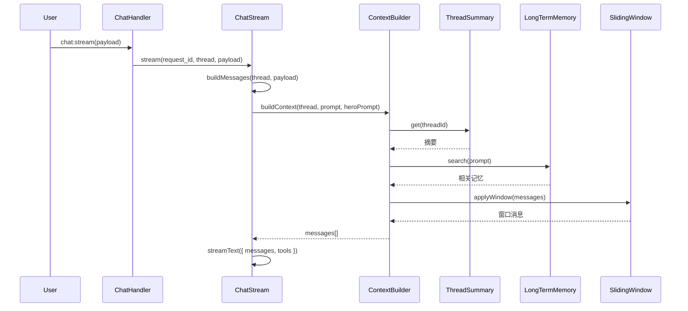
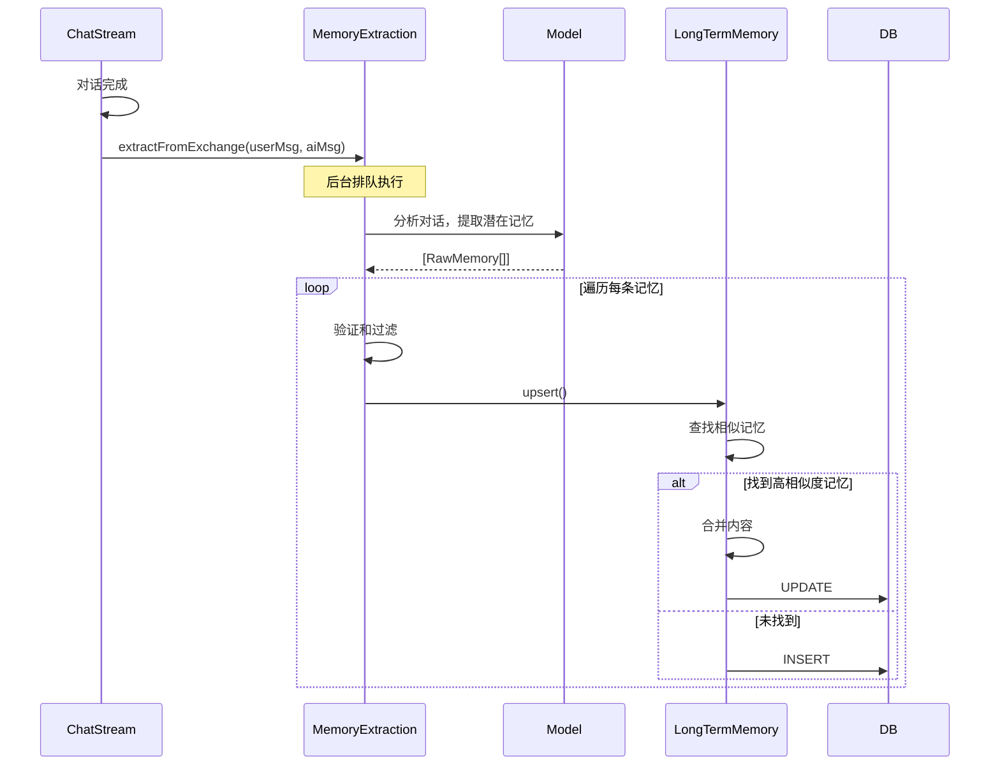
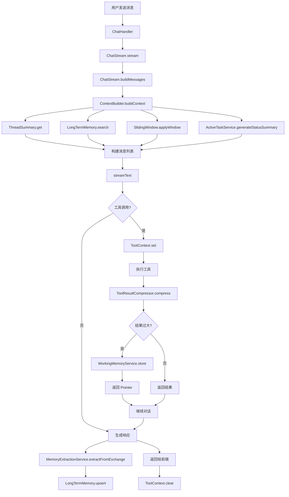
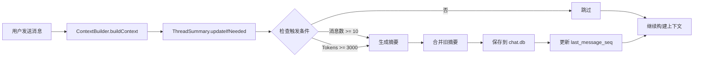
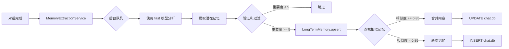

# Context 系统集成

## 概述

Context 系统是 Vibecape 的基础架构之一，为聊天、Hero 执行、工具调用等核心功能提供上下文管理支持。本文档详细说明 Context 系统与外界的集成关系。

## 架构层次

```
┌─────────────────────────────────────────────────────────────┐
│                       应用层 (Application)                    │
│  ┌──────────────┐  ┌──────────────┐  ┌──────────────┐       │
│  │  ChatPanel   │  │ HeroSidebar  │  │  Document    │       │
│  │  (聊天界面)   │  │  (Hero列表)  │  │   Editor     │       │
│  └──────┬───────┘  └──────┬───────┘  └──────┬───────┘       │
└─────────┼──────────────────┼──────────────────┼──────────────┘
          │                  │                  │
┌─────────▼──────────────────▼──────────────────▼──────────────┐
│                    IPC Handler 层                             │
│  ┌──────────────┐  ┌──────────────┐  ┌──────────────┐       │
│  │ ChatHandler  │  │ContextHandler│  │ HeroHandler  │       │
│  │ (聊天处理)    │  │ (上下文API)   │  │  (Hero管理)  │       │
│  └──────┬───────┘  └──────┬───────┘  └──────┬───────┘       │
└─────────┼──────────────────┼──────────────────┼──────────────┘
          │                  │                  │
┌─────────▼──────────────────▼──────────────────▼──────────────┐
│                     Service 层                                │
│  ┌──────────────┐  ┌──────────────┐  ┌──────────────┐       │
│  │ ChatStream   │  │  Chat        │  │HeroService   │       │
│  │ (流式对话)    │  │ (会话管理)    │  │ (Hero业务)   │       │
│  │              │  │              │  │              │       │
│  │ ↓↓↓↓↓↓↓↓↓   │  │              │  │              │       │
│  │ContextBuilder│  │              │  │              │       │
│  └──────────────┘  └──────────────┘  └──────────────┘       │
└─────────────────────────────────────────────────────────────┘
          │                  │                  │
┌─────────▼──────────────────▼──────────────────▼──────────────┐
│                   Context 系统层                              │
│  ┌──────────────────────────────────────────────────────┐   │
│  │              ContextBuilder (核心协调器)             │   │
│  │  ┌──────────┐ ┌──────────┐ ┌──────────┐ ┌─────────┐  │   │
│  │  │TokenCount│ │SlidingWin│ │ThreadSumm│ │LongTerm │  │   │
│  │  │          │ │   dow     │ │   ary     │ │ Memory  │  │   │
│  │  └──────────┘ └──────────┘ └──────────┘ └─────────┘  │   │
│  └──────────────────────────────────────────────────────┘   │
└─────────────────────────────────────────────────────────────┘
          │
┌─────────▼────────────────────────────────────────────────────┐
│                   数据存储层                                  │
│  ┌──────────────┐  ┌──────────────┐  ┌──────────────┐       │
│  │   chat.db    │  │   app.db     │  │  WorkingMem  │       │
│  │ (摘要/记忆)   │  │  (Hero配置)  │  │  (临时缓存)   │       │
│  └──────────────┘  └──────────────┘  └──────────────┘       │
└─────────────────────────────────────────────────────────────┘
```

## 核心集成点

### 1. ChatStream（流式对话服务）

**位置**：`package/src/main/services/ChatStream.ts`

**集成方式**：ChatStream 是 Context 系统的主要使用者

```typescript
import {
  ContextBuilder,
  ToolResultCompressor,
  MemoryExtractionService,
  ActiveTaskService,
  ToolContext,
} from "../context";

class ChatStreamService {
  /**
   * 构建消息列表
   * 使用 ContextBuilder 实现上下文管理
   */
  async buildMessages(
    thread: ChatThread | null,
    payload: { prompt: string; messages?: UIMessage[]; heroId?: string }
  ): Promise<ModelMessage[]> {
    // 1. 获取 Hero 配置
    const hero = this.getHeroForPayload(payload.heroId);
    const systemPrompt = hero.getSystemPrompt();

    if (!thread) {
      // 2a. 非聊天场景：使用简单上下文构建
      return ContextBuilder.buildSimpleContext(
        systemPrompt,
        payload.prompt,
        previousMessages
      );
    }

    // 2b. 聊天场景：完整上下文构建
    // 先添加用户消息到历史
    await Chat.addMessage(thread.id, "user", [
      { type: "text", text: payload.prompt },
    ]);

    const refreshed = await Chat.getThread(thread.id);

    // 3. 使用 ContextBuilder 构建上下文
    const context = await ContextBuilder.buildContext(
      refreshed,
      payload.prompt,
      systemPrompt,
      { includeCurrentInput: false }
    );

    // 4. 记录上下文统计
    log.info("上下文构建完成", {
      tokens: context.tokenStats.total,
      messages: context.metadata.includedMessageCount,
      summarized: context.metadata.summarizedMessageCount,
      usedSummary: context.metadata.usedSummary,
    });

    return context.messages as ModelMessage[];
  }
}
```

**调用时机**：
- 用户发送消息时
- 触发流式对话前
- 每次请求都会重新构建上下文

**数据流**：



### 2. ContextHandler（上下文管理 API）

**位置**：`package/src/main/handler/context/ContextHandler.ts`

**集成方式**：提供前端可调用的 Context 管理接口

```typescript
import {
  ThreadSummary,
  ContextBuilder,
  estimateTokens,
  SlidingWindow,
} from "../../context";

// ============ 上下文统计 ============

createHandler("context:stats").handle(async (_ctx, threadId: string) => {
  const thread = await Chat.getThread(threadId);

  // 获取摘要信息
  const summary = await ThreadSummary.get(threadId);
  const summaryTokens = summary ? estimateTokens(summary.content) : 0;

  // 估算消息 tokens
  let totalMessageTokens = 0;
  for (const msg of thread.messages) {
    totalMessageTokens += estimateTokens(extractText(msg));
  }

  // 滑动窗口统计
  const windowResult = SlidingWindow.applyWindow(
    thread.messages,
    (summary?.last_message_seq ?? 0) + 1
  );

  return {
    threadId,
    messageCount: thread.messages.length,
    totalMessageTokens,
    summary: { /* ... */ },
    slidingWindow: {
      includedCount: windowResult.messages.length,
      excludedCount: windowResult.excludedCount,
      windowTokens: windowResult.totalTokens,
    },
    config: ContextBuilder.getConfig(),
  };
});

// ============ 摘要管理 ============

createHandler("context:compact").handle(async (_ctx, threadId: string) => {
  await ThreadSummary.forceUpdate(threadId);
  const summary = await ThreadSummary.get(threadId);
  return { success: true, summary };
});

createHandler("context:summary").handle(async (_ctx, threadId: string) => {
  const summary = await ThreadSummary.get(threadId);
  return summary;
});

createHandler("context:reset-summary").handle(async (_ctx, threadId: string) => {
  await ThreadSummary.delete(threadId);
  return { success: true };
});

// ============ 上下文预热 ============

createHandler("context:warmup").handle(
  async (_ctx, payload: { threadId: string; heroId?: string }) => {
    const { ContextCache } = await import("../../context");
    const { getHero, getDefaultHero } = await import("../../heroes");

    const thread = await Chat.getThread(threadId);
    const hero = heroId ? getHero(heroId) ?? getDefaultHero() : getDefaultHero();

    // 异步预热，不等待完成
    ContextCache.warmUp(thread, hero.id, hero.getSystemPrompt());

    return { success: true };
  }
);
```

**IPC 通道列表**：

| 通道 | 参数 | 返回值 | 功能 |
|------|------|--------|------|
| `context:stats` | `threadId` | 上下文统计信息 | 获取会话的 Token 统计 |
| `context:compact` | `threadId` | `{ success, summary }` | 强制压缩会话（生成摘要） |
| `context:summary` | `threadId` | `ThreadSummary` | 获取会话摘要 |
| `context:reset-summary` | `threadId` | `{ success }` | 删除会话摘要 |
| `context:config` | - | `ContextBuilderConfig` | 获取上下文构建器配置 |
| `context:warmup` | `{ threadId, heroId? }` | `{ success }` | 预热上下文缓存 |

### 3. Hero Tools（工具集成）

**位置**：`package/src/main/heroes/tools/common.ts`

**集成方式**：Context 系统为工具提供记忆读取能力

```typescript
export const commonTools = {
  /**
   * 读取工作记忆中的大型内容
   */
  read_working_memory: tool({
    description: `读取因内容过大而被保存到工作记忆中的工具结果。
只有当你看到工具返回 "_OFFLOADED_" 标记和 memoryId 时，才使用此工具。`,
    inputSchema: z.object({
      memoryId: z.string(),
      start: z.number().optional(),
      end: z.number().optional(),
    }),
    execute: async ({ memoryId, start, end }) => {
      // 动态导入避免循环依赖
      const { WorkingMemoryService } = await import("@main/context/WorkingMemoryService");
      const content = WorkingMemoryService.read(memoryId, { start, end });

      if (content === null) {
        return { success: false, error: "Memory ID not found or expired." };
      }

      return {
        success: true,
        memoryId,
        content,
        length: content.length,
        isPartial: !!(start || end),
      };
    },
  }),

  /**
   * 搜索长期记忆
   */
  search_memory: tool({
    description: `搜索长期记忆中与查询相关的信息。
用于：
- 回忆用户之前提到的偏好
- 获取用户相关的长期信息`,
    inputSchema: z.object({
      query: z.string(),
      category: z.enum(["user_preference", "project_context", "fact", "skill"]).optional(),
      limit: z.number().min(1).max(10).default(5),
    }),
    execute: async ({ query, category, limit }) => {
      const { LongTermMemory } = await import("@main/context/LongTermMemory");

      const memories = await LongTermMemory.search(query, {
        limit,
        minSimilarity: 0.6,
        category: category as any,
      });

      return {
        success: true,
        count: memories.length,
        memories: memories.map((m) => ({
          content: m.content,
          similarity: m.similarity,
          category: m.category,
        })),
      };
    },
  }),
};
```

### 4. MemoryExtractionService（自动记忆提取）

**位置**：`package/src/main/context/MemoryExtractionService.ts`

**集成方式**：在对话结束后自动提取有价值的信息

```typescript
// ChatStream.ts - 对话完成后触发

async handleStreamResponse(...) {
  // ... 流式响应处理

  const assistantMessage = state.currentText;

  // 对话结束后自动提取记忆
  MemoryExtractionService.extractFromExchange(
    payload.prompt,      // 用户消息
    assistantMessage     // 助手回复
  );

  // 清理 ToolContext
  ToolContext.clear();
}
```

**执行流程**：



### 5. ToolContext（工具上下文）

**位置**：`package/src/main/context/ToolContext.ts`

**集成方式**：为工具执行提供当前对话上下文

```typescript
// ChatStream.ts - 在执行工具前设置

async handleStreamResponse(...) {
  // 设置 ToolContext
  const lastUserMsg = messages.filter((m) => m.role === "user").pop();
  const currentInput = typeof lastUserMsg?.content === "string"
    ? lastUserMsg.content
    : "";

  ToolContext.set({
    threadId,
    messages,
    currentInput,
    systemPrompt: hero.getSystemPrompt(),
    heroId: hero.id,
    repository: SpaceService.getCurrentBinding() ?? undefined,
  });

  // ... 工具调用

  // 清理 ToolContext
  ToolContext.clear();
}

// 工具内部访问上下文
import { ToolContext, getRepositoryForTask } from "@main/context";

const context = ToolContext.get();
const currentInput = context?.currentInput;
const repoId = getRepositoryForTask();
```

## 数据流图

### 完整的对话流程



### 摘要更新流程



### 记忆提取流程



## 配置和定制

### ContextBuilder 配置

```typescript
import { ContextBuilder } from "./context";

// 获取当前配置
const config = ContextBuilder.getConfig();

// 更新配置
ContextBuilder.setConfig({
  totalBudget: 48000,
  slidingWindowSize: 20,
  enableSummary: true,
  enableMemoryRetrieval: true,
  enableToolResultCompression: true,
  enableInstructionPinning: true,
});
```

### ThreadSummary 配置

```typescript
import { ThreadSummary } from "./context";

ThreadSummary.setConfig({
  messageThreshold: 10,              // 消息数阈值
  maxSummaryTokens: 1000,            // 最大摘要 Token 数
  modelSlot: "fast",                 // 使用的模型
  tokenCompactionThreshold: 3000,    // Token 压缩阈值
  enableTokenBasedCompaction: true,  // 启用 Token 阈值
});
```

### MemoryExtraction 配置

```typescript
import { MemoryExtractionService } from "./context";

MemoryExtractionService.setConfig({
  enabled: true,                    // 是否启用
  minImportance: 5,                 // 最小重要度
  updateSimilarityThreshold: 0.85,  // 更新相似度阈值
});
```

## 性能考虑

### 异步非阻塞

Context 系统采用多处异步设计，避免阻塞主流程：

1. **记忆检索超时**：
```typescript
const memories = await Promise.race([
  LongTermMemory.search(query),
  new Promise((_, reject) =>
    setTimeout(() => reject(new Error("timeout")), 500)
  ),
]);
```

2. **摘要更新异步**：
```typescript
ThreadSummary.updateIfNeeded(threadId).catch(() => {
  logger.warn("摘要更新失败");
});
```

3. **记忆提取排队**：
```typescript
this.extractionQueue = this.extractionQueue
  .then(() => this.doExtract(userMsg, aiMsg))
  .catch(() => {});
```

### 上下文预热

前端可以在用户打开会话时预热上下文：

```typescript
// 前端
ipcRenderer.invoke("context:warmup", {
  threadId: currentThread.id,
  heroId: selectedHeroId,
});

// 后端 - ContextCache
warmUp(thread: ChatThread, heroId: string, systemPrompt: string) {
  const cacheKey = this.getCacheKey(thread.id, heroId);
  this.cache.set(cacheKey, {
    context: this.buildContext(thread, "", systemPrompt),
    timestamp: Date.now(),
  });
}
```

### Token 估算优化

使用字符计数代替 tokenizer：

```typescript
// 中文约 1.8 字符/token，英文约 4 字符/token
const chineseRatio = getChineseRatio(text);
const charsPerToken = chineseRatio * 1.8 + (1 - chineseRatio) * 4;
const tokens = Math.ceil(text.length / charsPerToken);
```

## 常见问题

### Context 系统会影响响应速度吗？

影响很小：

1. **Token 计数**：使用字符计数，约 1-2ms
2. **记忆检索**：500ms 超时，通常 100-200ms 完成
3. **摘要更新**：异步执行，不阻塞主流程
4. **滑动窗口**：内存操作，约 5-10ms

总体延迟增加通常在 100-300ms 之间，远小于 LLM API 的响应时间。

### Context 系统的数据存储在哪里？

- **chat.db**：会话摘要、长期记忆
- **Working Memory**：临时缓存，进程结束后释放
- **ContextCache**：运行时缓存，TTL 5 分钟

### 如何禁用某个功能？

```typescript
// 禁用会话摘要
ContextBuilder.setConfig({ enableSummary: false });

// 禁用长期记忆检索
ContextBuilder.setConfig({ enableMemoryRetrieval: false });

// 禁用工具结果压缩
ContextBuilder.setConfig({ enableToolResultCompression: false });

// 禁用指令钉选
ContextBuilder.setConfig({ enableInstructionPinning: false });

// 禁用自动记忆提取
MemoryExtractionService.setConfig({ enabled: false });
```

### 如何调试 Context 系统？

使用 ContextHandler 提供的 API：

```typescript
// 获取上下文统计
const stats = await ipcRenderer.invoke("context:stats", threadId);
console.log("消息数量:", stats.messageCount);
console.log("总 Token:", stats.totalMessageTokens);
console.log("摘要信息:", stats.summary);
console.log("滑动窗口:", stats.slidingWindow);

// 获取会话摘要
const summary = await ipcRenderer.invoke("context:summary", threadId);

// 手动触发摘要压缩
await ipcRenderer.invoke("context:compact", threadId);
```

## 相关文档

- [系统概述](./overview) - Context 系统的整体架构
- [上下文构建](./context-builder) - ContextBuilder 的详细实现
- [记忆管理](./memory-management) - ThreadSummary 和 LongTermMemory
- [Token 管理](./token-management) - Token 计数和预算控制
- [Hero 系统集成](../hero-system/chat-integration) - Hero 与聊天的集成
