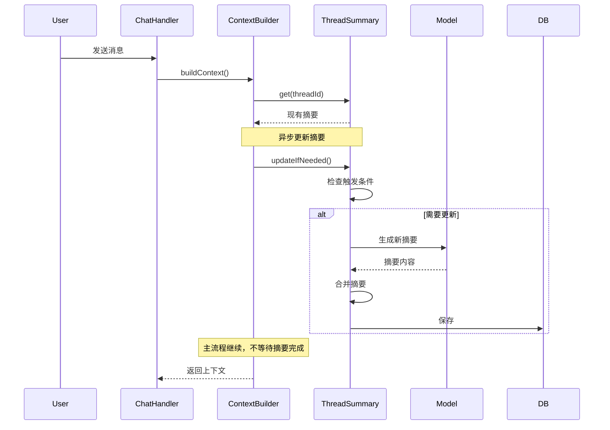
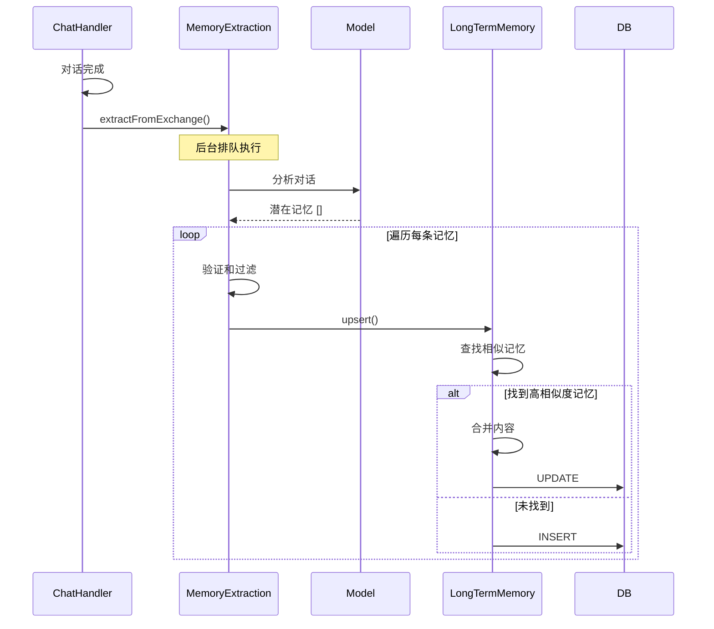

# 记忆管理实现

## 概述

Context 系统的记忆管理包含两个核心组件：

1. **ThreadSummary（会话摘要）**：压缩单个会话的历史对话
2. **LongTermMemory（长期记忆）**：跨会话的持久化记忆

两者配合，确保 AI 能够理解短期历史和长期偏好。

## ThreadSummary（会话摘要）

### 核心功能

会话摘要负责压缩长对话历史，保留关键信息：

- **增量生成**：新摘要与旧摘要合并
- **双层触发**：消息数阈值 + Token 阈值
- **异步更新**：不阻塞主流程
- **智能合并**：保留重要决策和偏好

### 触发机制

参考 [Goose](https://github.com/goose-router/goose) 的两层压缩策略：

```typescript
interface SummaryConfig {
  /** 消息数阈值 (默认 10 条) */
  messageThreshold: number;
  /** Token 压缩阈值 (默认 3000) */
  tokenCompactionThreshold: number;
  /** 是否启用 Token 阈值触发 */
  enableTokenBasedCompaction: boolean;
}

// 检查触发条件
const messageCountTrigger = newMessageCount >= this.config.messageThreshold;
const tokenTrigger = totalTokens > this.config.tokenCompactionThreshold;

// 两个条件任一满足即触发
if (messageCountTrigger || tokenTrigger) {
  await this.generateIncrementalSummary(existing, newMessages);
}
```

**消息数阈值**：
- 定期触发，确保历史不会过长
- 简单可靠，易于预测

**Token 阈值**：
- 动态触发，处理大内容场景
- 避免单个大消息导致上下文爆炸

### 增量摘要生成

```typescript
private async generateIncrementalSummary(
  previousSummary: string | undefined,
  newMessages: ChatMessage[]
): Promise<string> {
  // 使用 fast 模型
  const model = await Model.get("fast");

  const userPrompt = previousSummary
    ? `基于以下现有摘要和新对话，生成更新后的摘要。

## 现有摘要
${previousSummary}

## 新对话
${formattedMessages}

请生成更新后的摘要：`
    : `请为以下对话生成摘要：

${formattedMessages}

请生成摘要：`;

  const result = streamText({
    model,
    messages: [
      {
        role: "system",
        content: `你是一个摘要助手。要求:
1. 摘要应简洁但全面
2. 保留关键信息：主要话题、重要决策、用户偏好
3. 使用第三人称描述
4. 不超过 500 字`,
      },
      { role: "user", content: userPrompt },
    ],
    temperature: 0.3,
  });

  await result.consumeStream();
  return await result.text;
}
```

### 降级策略

如果 LLM 调用失败，返回简单的统计信息：

```typescript
try {
  const result = streamText({ model, messages });
  return await result.text;
} catch (error) {
  log.error("生成摘要失败");
  // 降级为简单统计
  return previousSummary
    ? `${previousSummary}\n[+${newMessages.length} 条新消息待摘要]`
    : `[${newMessages.length} 条消息待摘要]`;
}
```

## LongTermMemory（长期记忆）

### 核心功能

长期记忆提供跨会话的持久化记忆：

- **语义检索**：基于向量相似度的 RAG 检索
- **自动提取**：每轮对话后自动分析并保存
- **智能合并**：相似记忆自动合并，避免重复
- **访问统计**：追踪记忆的使用频率

### 记忆分类

```typescript
export type MemoryCategory =
  | "user_preference"    // 用户偏好（技术栈、格式、风格）
  | "project_context"    // 项目上下文
  | "skill"             // 技能相关知识
  | "fact";             // 事实性信息
```

### Upsert 逻辑

**核心思想**：基于向量相似度决定新增或更新

```typescript
async upsert(
  data: {
    category: MemoryCategory;
    content: string;
    importance?: number;
  },
  options: { similarityThreshold?: number } = {}
): Promise<{ action: "created" | "updated"; record: LongTermMemoryRecord }> {
  const { similarityThreshold = 0.85 } = options;

  // 1. 生成 query embedding
  const queryVector = await EmbeddingService.embed(data.content);

  // 2. 找到最相似的候选
  const candidates = await chatDb.query.longTermMemories.findMany({
    where: and(
      isNotNull(longTermMemories.embedding),
      eq(longTermMemories.category, data.category)
    ),
  });

  let best: { rec: LongTermMemoryRecord; sim: number } | null = null;
  for (const rec of candidates) {
    const sim = vectorUtils.cosineSimilarity(queryVector, rec.embedding);
    if (!best || sim > best.sim) best = { rec, sim };
  }

  // 3. 判断是更新还是新增
  if (best && best.sim >= similarityThreshold) {
    // 更新：合并内容
    const mergedContent = this.mergeContent(
      best.rec.content,
      data.content
    );
    const record = await this.update(best.rec.id, {
      content: mergedContent,
      importance: Math.max(best.rec.importance, data.importance || 5),
    });
    return { action: "updated", record };
  }

  // 新增
  const record = await this.add({
    category: data.category,
    content: data.content,
    importance: data.importance || 5,
  });
  return { action: "created", record };
}
```

### 内容合并策略

```typescript
private mergeContent(existing: string, incoming: string): string {
  const a = existing.trim();
  const b = incoming.trim();

  if (!a) return b;
  if (!b) return a;
  if (a === b) return a;
  if (a.includes(b)) return a;  // 已包含
  if (b.includes(a)) return b;  // 新的更完整

  const merged = `${a}\n${b}`;
  // 避免无限增长
  return merged.length > 2000 ? b : merged;
}
```

### 语义检索

```typescript
async search(
  query: string,
  options: {
    limit?: number;           // 返回数量（默认 5）
    minSimilarity?: number;   // 最小相似度（默认 0.6）
    category?: MemoryCategory; // 分类过滤
  } = {}
): Promise<MemorySearchResult[]> {
  const { limit = 5, minSimilarity = 0.6, category } = options;

  // 1. 生成 query embedding
  const queryVector = await EmbeddingService.embed(query);

  // 2. 获取所有有向量的记忆
  const whereConditions = [isNotNull(longTermMemories.embedding)];
  if (category) {
    whereConditions.push(eq(longTermMemories.category, category));
  }

  const allMemories = await chatDb.query.longTermMemories.findMany({
    where: and(...whereConditions),
  });

  // 3. 计算相似度
  const results: MemorySearchResult[] = [];
  for (const mem of allMemories) {
    const docVector = vectorUtils.deserializeVector(mem.embedding);
    const similarity = vectorUtils.cosineSimilarity(queryVector, docVector);

    if (similarity >= minSimilarity) {
      results.push({ ...mem, similarity });
    }
  }

  // 4. 按相似度排序
  results.sort((a, b) => b.similarity - a.similarity);

  // 5. 更新访问统计
  const topResults = results.slice(0, limit);
  this.updateAccessStats(topResults.map((r) => r.id));

  return topResults;
}
```

## MemoryExtractionService（自动记忆提取）

### 核心功能

自动从对话中提取有价值的信息：

- **完全自动化**：无需用户手动维护
- **智能过滤**：只提取与用户相关的长期信息
- **后台执行**：不阻塞主流程

### 提取流程

```typescript
extractFromExchange(userMessage: string, assistantMessage: string): void {
  if (!this.config.enabled) return;

  // 排队执行，避免并发
  this.extractionQueue = this.extractionQueue
    .then(() => this.doExtract(userMessage, assistantMessage))
    .catch(() => {
      log.error("提取失败");
    });
}

private async doExtract(
  userMessage: string,
  assistantMessage: string
): Promise<void> {
  // 1. 跳过过短的对话
  if (userMessage.length < 20 && assistantMessage.length < 50) {
    return;
  }

  // 2. 使用 fast 模型分析
  const model = await Model.get("fast");

  const prompt = `分析以下对话，提取值得长期记住的【用户相关信息】。

用户: ${userMessage.slice(0, 500)}
助手: ${assistantMessage.slice(0, 1000)}

只提取与【用户本人】相关的长期信息，例如：
- 偏好：技术栈偏好、格式偏好、写作/回复风格
- 习惯：常用流程、固定约定、常见选择

以 JSON 数组格式返回，每条记忆包含:
- category: "user_preference"
- content: 内容 (简洁但完整)
- importance: 重要度 1-10

如果没有值得记忆的内容，返回空数组 []`;

  const result = streamText({
    model,
    messages: [{ role: "user", content: prompt }],
    temperature: 0.3,
  });

  await result.consumeStream();
  const text = await result.text;

  // 3. 解析 JSON
  const jsonMatch = text.match(/\[[\s\S]*\]/);
  if (!jsonMatch) return;

  const memories: RawMemory[] = JSON.parse(jsonMatch[0]);

  // 4. 处理每条记忆
  for (const mem of memories) {
    await this.processMemory(mem);
  }
}
```

### 记忆过滤

```typescript
private async processMemory(mem: RawMemory): Promise<void> {
  // 1. 验证格式
  if (!mem.category || !mem.content || typeof mem.importance !== "number") {
    return;
  }

  // 2. 过滤低重要度
  if (mem.importance < this.config.minImportance) {
    return;
  }

  // 3. 验证分类
  const validCategories: MemoryCategory[] = ["user_preference"];
  if (!validCategories.includes(mem.category as MemoryCategory)) {
    return;
  }

  // 4. 保存到长期记忆
  try {
    const result = await LongTermMemory.upsert(
      {
        category: mem.category as MemoryCategory,
        content: mem.content,
        importance: mem.importance,
      },
      { similarityThreshold: this.config.updateSimilarityThreshold }
    );

    log.info("保存记忆", {
      action: result.action,
      content: result.record.content.slice(0, 50),
    });
  } catch (err) {
    log.error("保存失败");
  }
}
```

## 数据流

### 摘要更新流程



### 记忆提取流程



## 配置选项

### ThreadSummary 配置

```typescript
interface SummaryConfig {
  /** 触发摘要的消息数阈值 */
  messageThreshold: number;
  /** 摘要的最大 Token 数 */
  maxSummaryTokens: number;
  /** 使用的模型槽位 */
  modelSlot: "fast" | "primary";
  /** Token 自动压缩阈值 */
  tokenCompactionThreshold: number;
  /** 是否启用 Token 阈值触发 */
  enableTokenBasedCompaction: boolean;
}

const DEFAULT_CONFIG: SummaryConfig = {
  messageThreshold: 10,
  maxSummaryTokens: 1000,
  modelSlot: "fast",
  tokenCompactionThreshold: 3000,
  enableTokenBasedCompaction: true,
};
```

### MemoryExtraction 配置

```typescript
interface ExtractionConfig {
  /** 是否启用自动提取 */
  enabled: boolean;
  /** 最小重要度阈值 */
  minImportance: number;
  /** 更新相似度阈值 */
  updateSimilarityThreshold: number;
}

const DEFAULT_CONFIG: ExtractionConfig = {
  enabled: true,
  minImportance: 5,
  updateSimilarityThreshold: 0.85,
};
```

## 使用示例

### 手动更新摘要

```typescript
import { ThreadSummary } from "./context";

// 检查并更新（如果需要）
await ThreadSummary.updateIfNeeded(threadId);

// 强制更新
await ThreadSummary.forceUpdate(threadId);

// 获取摘要
const summary = await ThreadSummary.get(threadId);
```

### 手动管理记忆

```typescript
import { LongTermMemory } from "./context";

// 添加记忆
const memory = await LongTermMemory.add({
  category: "user_preference",
  content: "用户喜欢使用 TypeScript",
  importance: 7,
});

// 语义搜索
const results = await LongTermMemory.search("TypeScript", {
  limit: 3,
  minSimilarity: 0.6,
  category: "user_preference",
});

// 列出所有记忆
const list = await LongTermMemory.list({
  limit: 20,
  category: "user_preference",
});
```

### 自动提取记忆

```typescript
import { MemoryExtractionService } from "./context";

// 对话结束后自动触发（通常在 ChatHandler 中）
MemoryExtractionService.extractFromExchange(
  userMessage,
  assistantMessage
);

// 更新配置
MemoryExtractionService.setConfig({
  enabled: true,
  minImportance: 6,
});
```

## 性能优化

### 异步非阻塞

```typescript
// 记忆检索超时
const memories = await Promise.race([
  LongTermMemory.search(query),
  new Promise((_, reject) =>
    setTimeout(() => reject(new Error("timeout")), 500)
  ),
]);

// 摘要更新异步
ThreadSummary.updateIfNeeded(threadId).catch(() => {});

// 记忆提取排队
this.extractionQueue = this.extractionQueue.then(() => this.doExtract());
```

### 向量检索优化

当前使用全内存计算，适用于个人场景：

```typescript
// 获取所有有向量的记忆
const allMemories = await chatDb.query.longTermMemories.findMany({
  where: isNotNull(longTermMemories.embedding),
});

// 内存中计算相似度
for (const mem of allMemories) {
  const similarity = vectorUtils.cosineSimilarity(queryVector, mem.embedding);
  if (similarity >= minSimilarity) {
    results.push({ ...mem, similarity });
  }
}
```

**未来优化**：
- 使用 SQLite 扩展（sqlite-vss）
- 分层检索（关键词 + 向量）
- 缓存热门查询

## 错误处理

### 摘要生成失败

```typescript
try {
  const result = streamText({ model, messages });
  return await result.text;
} catch (error) {
  log.error("生成摘要失败");
  // 降级为简单统计
  return previousSummary
    ? `${previousSummary}\n[+${newMessages.length} 条新消息]`
    : `[${newMessages.length} 条消息]`;
}
```

### Embedding 失败

```typescript
try {
  await this.ensureModelReady();
  const vector = await EmbeddingService.embed(content);
  embeddingStr = vectorUtils.serializeVector(vector);
} catch (error) {
  log.warn("生成嵌入失败");
  // 允许无向量存储，但无法被检索
}
```

## 相关文档

- [系统概述](./overview) - Context 系统的整体架构
- [数据模型](./data-model) - Context 系统的数据结构
- [上下文构建](./context-builder) - ContextBuilder 的实现
- [Token 管理](./token-management) - Token 计数和预算控制
