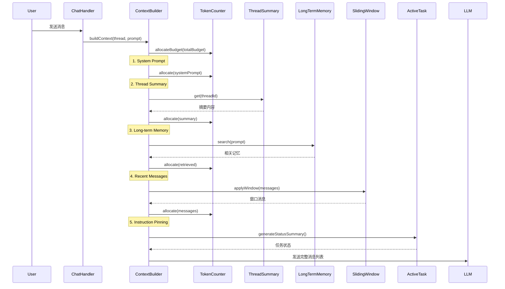
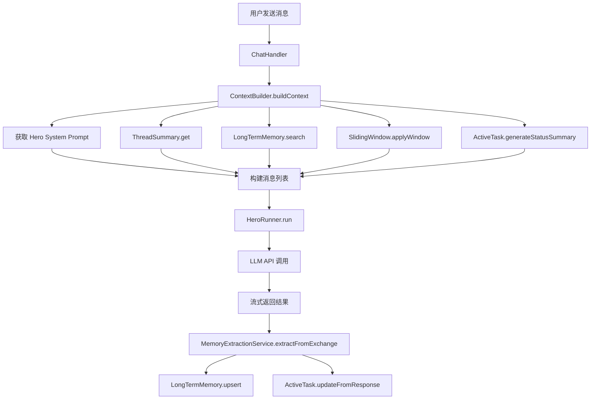
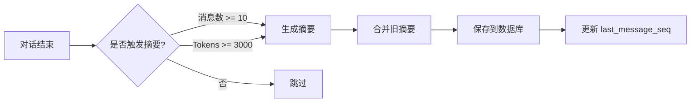

# Context 系统概述

## 什么是 Context 系统？

Context 系统是 Vibecape 中 Hero/Agent 对话的上下文管理核心。它负责整合各种信息源，构建最优的消息列表发送给 LLM，确保 AI 能够：

- **理解对话历史**：通过滑动窗口和会话摘要
- **记住用户偏好**：通过长期记忆的语义检索
- **有效利用工具**：通过工具结果压缩和工作记忆卸载
- **保持任务专注**：通过活动任务追踪和指令钉选
- **控制 Token 使用**：通过智能预算分配和截断策略

## 核心挑战

在使用 LLM 构建复杂应用时，Context Window 的管理是关键挑战：

1. **Token 限制**：模型有固定的上下文窗口（如 128K、200K tokens）
2. **信息密度**：需要确保发送的信息最有价值，避免"噪音"
3. **记忆持久性**：重要信息不能因为滑动窗口而丢失
4. **响应延迟**：过长的上下文会增加推理延迟和成本
5. **工具调用开销**：工具结果可能非常大，需要智能压缩

## 系统架构

Context 系统采用模块化架构，各组件职责清晰：

```
┌─────────────────────────────────────────────────────────┐
│                   ContextBuilder                        │
│            (上下文构建协调器)                             │
└────────────────────┬────────────────────────────────────┘
                     │
        ┌────────────┼────────────┐
        │            │            │
┌───────▼──────┐ ┌──▼──────────┐ ┌▼──────────────┐
│ SlidingWindow│ │ThreadSummary│ │LongTermMemory │
│  (滑动窗口)   │ │  (会话摘要)  │ │  (长期记忆)   │
└───────┬──────┘ └──┬──────────┘ └▼──────────────┘
        │           │            │
┌───────▼──────┐ ┌──▼──────────┐ ┌▼──────────────┐
│TokenCounter  │ │ ToolResult  │ │ActiveTask     │
│  (Token计数) │ │ Compressor  │ │  Service      │
└──────────────┘ │ (工具压缩)  │ │ (任务追踪)   │
                 └─────────────┘ └───────────────┘
```

### 核心组件

**1. ContextBuilder（上下文构建器）**
- 统一协调所有上下文来源
- 智能分配 Token 预算
- 构建最终的消息列表

**2. TokenCounter（Token 计数器）**
- 估算文本的 Token 数量
- 跟踪预算使用情况
- 支持文本截断

**3. SlidingWindow（滑动窗口）**
- 保留最近的 N 轮对话
- 支持 Tool Call 格式
- 按 Token 预算动态调整

**4. ThreadSummary（会话摘要）**
- 增量生成对话摘要
- 压缩历史对话
- 支持消息数和 Token 双阈值触发

**5. LongTermMemory（长期记忆）**
- 存储跨会话的重要信息
- 基于语义相似度的检索（RAG）
- 自动向量嵌入和更新

**6. ToolResultCompressor（工具结果压缩）**
- 针对不同工具的压缩策略
- 大型内容卸载到工作记忆
- 保留关键信息结构

**7. ActiveTaskService（活动任务服务）**
- 追踪当前任务目标
- 记录完成的步骤和发现
- 生成状态摘要注入上下文

**8. MemoryExtractionService（记忆提取）**
- 自动从对话中提取有价值信息
- 智能合并重复记忆
- 持久化到长期记忆

## 上下文构建流程

当用户发送消息时，Context 系统按以下顺序构建上下文：



### Token 预算分配策略

默认配置（总预算 48000 tokens）：

```typescript
{
  systemPrompt: 9600,     // 20% - Hero 系统提示词
  summary: 4800,          // 10% - 会话摘要
  retrieved: 4800,        // 10% - 长期记忆检索
  recentMessages: 26400,  // 55% - 近期消息（滑动窗口）
  currentInput: 2400,     // 5%  - 当前输入
  reserved: 0             // 0%  - 预留（通过安全网处理）
}
```

## 核心概念

### 1. 滑动窗口（Sliding Window）

保留最近的 N 轮对话，旧消息被摘要压缩：

```
[原始消息]
User: Hello
Assistant: Hi
User: How are you?
Assistant: I'm good
User: Tell me about X
Assistant: [关于 X 的详细解释]
... (100+ messages)

[滑动窗口后]
[对话背景摘要]
用户询问了关于 X、Y、Z 的话题...

User: Tell me about W
Assistant: [关于 W 的回答]
```

### 2. 会话摘要（Thread Summary）

当消息超过阈值时，自动生成摘要：

- **触发条件**：消息数阈值（默认 10 条）或 Token 阈值（默认 3000）
- **摘要内容**：主要话题、重要决策、用户偏好、技术细节
- **增量更新**：新摘要与旧摘要合并

### 3. 长期记忆（Long-term Memory）

跨会话的持久化记忆，使用向量检索：

- **分类**：用户偏好、项目上下文、技能、事实
- **检索**：基于语义相似度（Cosine Similarity）
- **自动提取**：每轮对话后自动分析并保存有价值的信息

### 4. 工具结果压缩（Tool Result Compression）

工具返回的结果可能很大，需要智能压缩：

- **列表截断**：只保留前 N 项
- **大文本卸载**：存入工作记忆，返回 Pointer
- **结构保留**：保留元数据和结构信息

### 5. 指令钉选（Instruction Pinning）

在上下文末尾再次附加当前指令，防止被中间内容冲刷：

```
[前面的上下文...]
[对话历史...]

[CRITICAL INSTRUCTION]
User's Current Goal: "解释 Context 系统"
Status: ACTIVE
Guide:
1. If you have just received tool outputs, briefly ANALYZE them first.
2. If the goal is complex, form a concise PLAN before executing.
3. Prioritize answering the User's Goal immediately.
```

## 数据流

### 完整对话流程



### 摘要更新流程



## 配置选项

### ContextBuilder 配置

```typescript
interface ContextBuilderConfig {
  totalBudget: number;                 // 总 Token 预算
  slidingWindowSize: number;           // 滑动窗口大小
  enableSummary: boolean;              // 是否启用摘要
  enableMemoryRetrieval: boolean;      // 是否启用记忆检索
  enableToolResultCompression: boolean; // 是否启用工具压缩
  enableInstructionPinning: boolean;   // 是否启用指令钉选
}
```

### ThreadSummary 配置

```typescript
interface SummaryConfig {
  messageThreshold: number;            // 消息数阈值
  maxSummaryTokens: number;            // 最大摘要 Token 数
  modelSlot: 'fast' | 'primary';       // 使用的模型
  tokenCompactionThreshold: number;    // Token 压缩阈值
  enableTokenBasedCompaction: boolean; // 是否启用 Token 阈值
}
```

### SlidingWindow 配置

```typescript
interface SlidingWindowConfig {
  windowSize: number;                  // 窗口大小（消息对数）
  maxMessageTokens: number;            // 单条消息最大 Token 数
  messagesBudget: number;              // 消息区域 Token 预算
}
```

## 设计决策

### 为什么使用两层摘要？

参考 [Goose](https://github.com/goose-router/goose) 的两层压缩策略：

1. **消息数阈值**：定期触发，确保历史不会过长
2. **Token 阈值**：动态触发，处理大内容场景

### 为什么使用指令钉选？

参考 Manus 的 Active Instruction Slot 模式：

- LLM 存在"近因效应"，更关注上下文末尾
- 工具调用结果可能在中间，冲刷原始指令
- 在末尾重复指令，确保 AI 保持专注

### 为什么自动提取记忆？

- 用户不会手动维护记忆库
- 每轮对话都可能包含有价值信息
- 自动化降低认知负担

## 性能考虑

### 异步非阻塞

- 记忆检索设置 500ms 超时
- 摘要更新异步执行，不阻塞主流程
- 记忆提取在后台排队执行

### Token 估算

- 使用简化的字符计数策略
- 中文约 1.8 字符/token，英文约 4 字符/token
- 避免调用 tokenizer API，减少延迟

### 缓存策略

- 滑动窗口保留最近消息
- 长期记忆使用向量索引
- 摘要增量更新，避免重新生成

## 相关文档

- [数据模型](./data-model) - Context 系统的数据结构
- [上下文构建](./context-builder) - ContextBuilder 详细实现
- [记忆管理](./memory-management) - 长期记忆和摘要
- [Token 管理](./token-management) - Token 计数和预算控制
