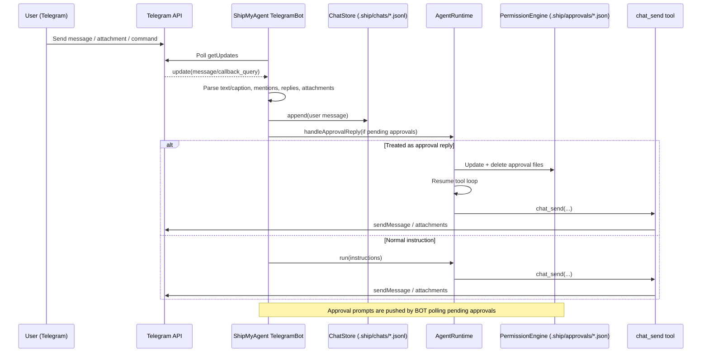

# Telegram: end-to-end message → agent → replies

> ⚠️ **Simplified mode (2026-02-03)**: the current `shipmyagent` package disables approvals (full-permission execution). Approval-related parts of this flow are outdated.

This page explains how a Telegram message is translated into ShipMyAgent instructions, how `AgentRuntime` executes them, and how replies are delivered via the `chat_send` tool.

> Code references: `package/src/adapters/telegram/bot.ts`, `package/src/adapters/base-chat-adapter.ts`, `package/src/runtime/agent/runtime.ts`, `package/src/runtime/chat/*`

## Overview



## Input: Telegram update → executable instructions

### Chat keys (per chat / thread)

ShipMyAgent uses a `chatKey` to isolate context:

- DM / regular group: `telegram:chat:<chatId>`
- Group topics: `telegram:chat:<chatId>:topic:<messageThreadId>`

### Group gating: mention / reply / follow-up window

In groups, messages are only considered when:

- Explicit: mention `@bot` or reply-to-bot
- Follow-up window: short period after an explicit trigger (so you can ask follow-ups without mentioning again)

There is also an access policy (`groupAccess`):

- Default: initiator of the thread or group admins
- Optional `"anyone"`: any group member can talk to the bot

### Attachments: local cache + `@attach` lines

Incoming files (document/photo/voice/audio) are downloaded and stored under:

- `.ship/.cache/telegram/`

Then the final `instructions` passed to the agent are prefixed with `@attach ...` lines, e.g.:

```text
@attach document .ship/.cache/telegram/1738...-report.pdf | report.pdf

Summarize this PDF and list action items.
```

## Persistence: ChatStore

Every incoming message is appended to a per-chat JSONL file:

- `.ship/chats/<encode(chatKey)>.jsonl`

Before execution, recent entries are loaded and collapsed into a compact “assistant context” that is injected back into the in-memory chat runtime for that `chatKey`.

## Execution

### Approval reply first

If the `chatKey` has pending approvals, ShipMyAgent tries to interpret the message as an approval reply first via:

- `agentRuntime.handleApprovalReply(...)`

This supports natural-language responses like “approve”, “reject because …”, “approve all”, etc.

### Tool-strict (agent-controlled sending)

ShipMyAgent integrations use a tool-strict pattern:

- The agent uses the `chat_send` tool to deliver replies (multiple messages, staged updates, etc.)
- The integration does not automatically forward the agent’s plain text output as chat messages

### Run + delivery

Telegram executes `agentRuntime.run(...)` for the current `chatKey`.

- Primary delivery path: the model calls `chat_send` to send replies (tool-strict).
- Fallback: if the model forgets to call `chat_send`, the adapter sends the final plain-text output.
- Messages are chunked for Telegram size limits; Markdown is attempted first, then it falls back to plain text.

### Background runs (optional)

ShipMyAgent persists run records under `.ship/runs/`. Some integrations may implement completion notifications by scanning these records; the Telegram adapter focuses on tool-driven replies and approval notifications.

## Approvals (human-in-the-loop)

When a tool requires approval:

1. PermissionEngine writes `.ship/approvals/<id>.json` (including `meta` such as `source=telegram`, `userId`, `chatKey`, `initiatorId`)
2. TelegramBot periodically notifies the originating chat
3. User replies either with natural language (handled by `handleApprovalReply`) or explicit commands/buttons
4. AgentRuntime resumes via `resumeFromApprovalActions()`, injects `ToolApprovalResponse`, deletes approval files, and continues execution
