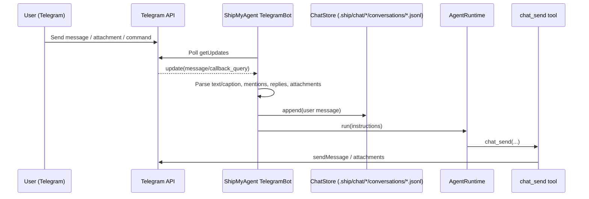

# Telegram: end-to-end message → agent → replies

> ⚠️ **Simplified mode (2026-02-03)**: the current `shipmyagent` package disables approvals (full-permission execution). Approval-related parts of this flow are outdated.

This page explains how a Telegram message is translated into ShipMyAgent instructions, how `AgentRuntime` executes them, and how replies are delivered via the `chat_send` tool.

> Code references: `package/src/adapters/telegram/bot.ts`, `package/src/adapters/base-chat-adapter.ts`, `package/src/runtime/agent/runtime.ts`, `package/src/runtime/chat/*`

## Overview



## Input: Telegram update → executable instructions

### Chat keys (per chat / thread)

ShipMyAgent uses a `chatKey` to isolate context:

- DM / regular group: `telegram-chat-<chatId>`
- Group topics (forum threads): `telegram-chat-<chatId>-topic-<messageThreadId>`

#### What is a Telegram “topic”?

Telegram **supergroups** can enable *Topics* (also called “Forum” mode). In that mode, a single group chat is split into multiple thread-like topics. Telegram marks messages in a topic with a `message_thread_id`.

ShipMyAgent treats each topic as an independent conversation context, so the bot’s memory/history is separated per topic:

- A message in the group “main chat” goes to `telegram-chat-<chatId>`
- A message in topic `#139` goes to `telegram-chat-<chatId>-topic-139`

### Group gating: mention / reply / follow-up window

In groups, messages are only considered when:

- Explicit: mention `@bot` or reply-to-bot
- Follow-up window: short period after an explicit trigger (so you can ask follow-ups without mentioning again)

There is also an access policy (`groupAccess`):

- Default: initiator of the thread or group admins
- Optional `"anyone"`: any group member can talk to the bot

### Attachments: local cache + `@attach` lines

Incoming files (document/photo/voice/audio) are downloaded and stored under:

- `.ship/.cache/telegram/`

Then the final `instructions` passed to the agent are prefixed with `@attach ...` lines, e.g.:

```text
@attach document .ship/.cache/telegram/1738...-report.pdf | report.pdf

Summarize this PDF and list action items.
```

## Persistence: ChatStore

Every incoming message is appended to a per-chat JSONL file:

- `.ship/chat/<encode(chatKey)>/conversations/messages.jsonl`

Before execution, recent entries are loaded and collapsed into a compact “assistant context” that is injected back into the in-memory chat runtime for that `chatKey`.
Before execution, the runtime uses an in-memory session history for the same `chatKey`. If the model needs more details from disk history, it can call `chat_load_history` to load and inject earlier messages from `.ship/chat/<chatKey>/conversations/messages.jsonl`.

### “All messages are stored” and used as context

In group chats, ShipMyAgent stores all incoming messages in `messages.jsonl`, and the recent history may be injected back into the model context for the current `chatKey`.

## Execution

### Tool-strict (agent-controlled sending)

ShipMyAgent integrations use a tool-strict pattern:

- The agent uses the `chat_send` tool to deliver replies (multiple messages, staged updates, etc.)
- The integration does not automatically forward the agent’s plain text output as chat messages

### Run + delivery

Telegram executes `agentRuntime.run(...)` for the current `chatKey`.

- Primary delivery path: the model calls `chat_send` to send replies (tool-strict).
- Fallback: if the model forgets to call `chat_send`, the adapter sends the final plain-text output.
- Messages are chunked for Telegram size limits; Markdown is attempted first, then it falls back to plain text.

### On-demand history loading (optional)

If the model decides it needs more context than the in-memory session provides, it can call `chat_load_history` to fetch earlier messages from `.ship/chat/<chatKey>/conversations/messages.jsonl` and inject them into the current in-flight context (before the current user message).

## Approvals (human-in-the-loop)

Approvals are disabled in the current simplified runtime (tools execute directly).
