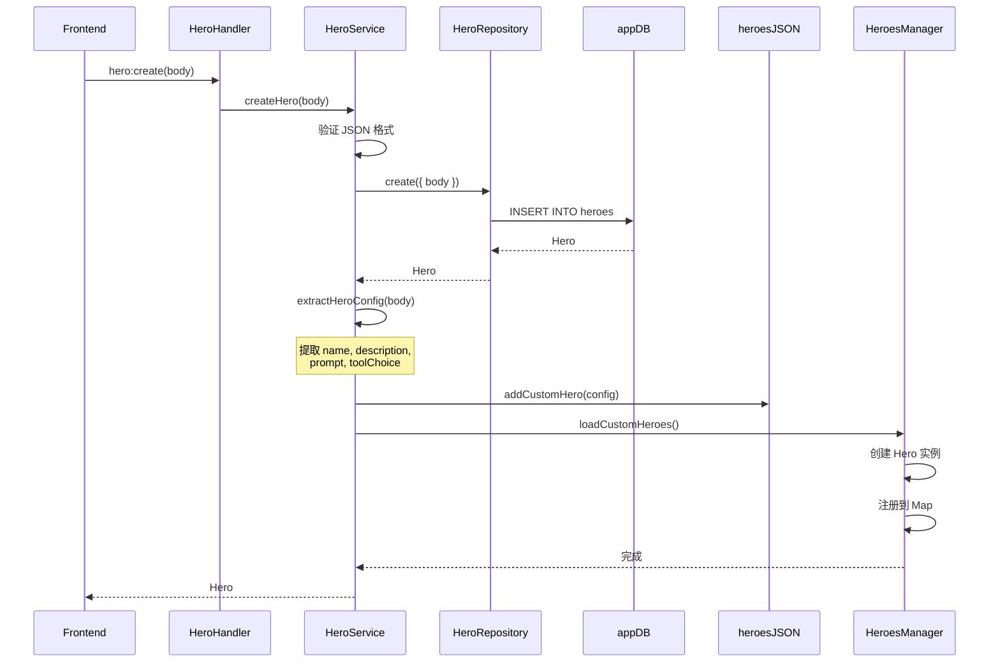
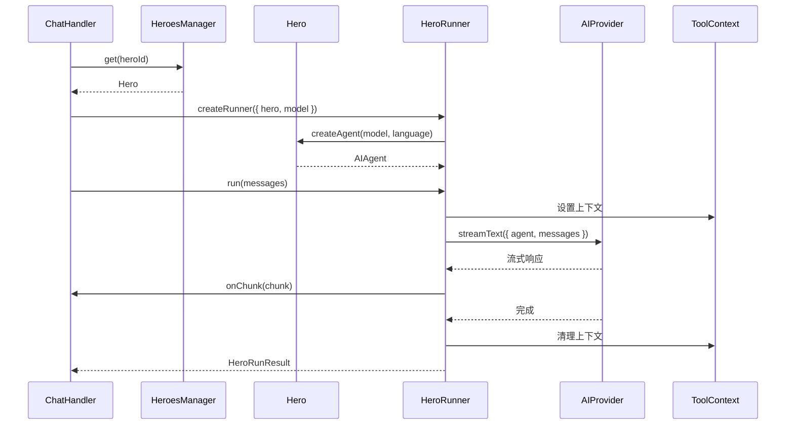

# Hero 后端实现

## 概述

Hero 系统的后端采用分层架构，从 IPC 通信到数据库操作，职责清晰，易于维护。

## 架构层次

```
┌─────────────────────────────────────────────────────────┐
│                   IPC Layer                              │
│                   HeroHandler                            │
│              (package/src/main/handler/app/)             │
└────────────────────┬────────────────────────────────────┘
                     │
┌────────────────────┴────────────────────────────────────┐
│                 Service Layer                            │
│                 HeroService                              │
│           (package/src/main/services/)                   │
└────────────────────┬────────────────────────────────────┘
                     │
┌────────────────────┴────────────────────────────────────┐
│               Repository Layer                           │
│               HeroRepository                             │
│          (package/src/main/repositories/)                │
└────────────────────┬────────────────────────────────────┘
                     │
┌────────────────────┴────────────────────────────────────┐
│                 Database Layer                           │
│                  app.db                                  │
│              (~/vibecape/app.db)                         │
└─────────────────────────────────────────────────────────┘
```

## IPC Handler 层

### HeroHandler

**位置：** `package/src/main/handler/app/HeroHandler.ts`

**功能：** 暴露 Hero CRUD 操作给渲染进程

**代码结构：**

```typescript
// package/src/main/handler/app/HeroHandler.ts

import { createHandler } from "../builder";
import { heroService } from "../../services/HeroService";

// ============ Hero 管理 ============

createHandler("hero:list").handle(async () => {
  return heroService.getAllHeroes();
});

createHandler("hero:get").handle(async (_ctx, id: string) => {
  const hero = await heroService.getHero(id);
  if (!hero) {
    throw new Error(`Hero "${id}" 不存在`);
  }
  return hero;
});

createHandler("hero:create").handle(async (_ctx, body: string) => {
  return heroService.createHero(body);
});

createHandler("hero:update").handle(
  async (_ctx, payload: { id: string; body: string }) => {
    return heroService.updateHero(payload.id, payload.body);
  }
);

createHandler("hero:delete").handle(async (_ctx, id: string) => {
  await heroService.deleteHero(id);
  return { success: true };
});
```

**Handler 注册机制：**

Vibecape 使用统一的 Handler 注册系统：

```typescript
// package/src/main/handler/builder.ts

export function createHandler(name: string) {
  return {
    handle: (fn: HandlerFunction) => {
      ipcMain.handle(name, async (event, ...args) => {
        // 自动错误处理
        try {
          // 性能日志
          const startTime = Date.now();
          const result = await fn(...args);
          const duration = Date.now() - startTime;
          console.log(`[Handler] ${name} completed in ${duration}ms`);
          return result;
        } catch (error) {
          console.error(`[Handler] ${name} failed:`, error);
          throw error;
        }
      });
    },
  };
}
```

**IPC 通道列表：**

| 通道 | 参数 | 返回值 | 功能 |
|------|------|--------|------|
| `hero:list` | - | `Hero[]` | 获取所有自定义 Hero |
| `hero:get` | `id: string` | `Hero` | 获取单个 Hero |
| `hero:create` | `body: string` | `Hero` | 创建新 Hero |
| `hero:update` | `{ id, body }` | `Hero` | 更新 Hero |
| `hero:delete` | `id: string` | `{ success }` | 删除 Hero |

### Chat Handler 中的 Hero

**位置：** `package/src/main/handler/chat.ts`

聊天处理器需要获取可用的 Hero 列表（包括内置 Hero）：

```typescript
createHandler("chat:heroes").handle(async () => {
  // 获取所有 Hero 元数据（内置 + 自定义）
  return HeroesManager.getAllMetas();
});
```

## Service 层

### HeroService

**位置：** `package/src/main/services/HeroService.ts`

**功能：** Hero 的业务逻辑层，处理 CRUD 操作和配置同步

**核心职责：**

1. Hero CRUD 操作
2. 从 Tiptap JSON 提取 Hero 配置
3. 同步到 `heroes.json` 配置文件
4. 管理 Hero 头像下载

**代码结构：**

```typescript
// package/src/main/services/HeroService.ts

import { heroRepository } from "../repositories/HeroRepository";
import { addCustomHero, updateCustomHero, removeCustomHero } from "./UserData";
import { HeroesManager } from "../heroes/HeroesManager";

export class HeroService {
  /**
   * 创建自定义 Hero
   */
  async createHero(body: string): Promise<Hero> {
    // 验证 JSON 格式
    try {
      JSON.parse(body);
    } catch (error) {
      throw new Error("无效的 JSON 格式");
    }

    // 创建数据库记录
    const hero = await heroRepository.create({ body });

    // 同步到 UserData 配置
    try {
      const heroConfig = await extractHeroConfig(hero.id, hero.body);
      addCustomHero(heroConfig);
      // 重新加载 Heroes
      HeroesManager.loadCustomHeroes();
    } catch (error) {
      console.error("[HeroService] Failed to sync hero to config:", error);
    }

    return hero;
  }

  /**
   * 获取单个 Hero
   */
  async getHero(id: string): Promise<Hero | null> {
    return await heroRepository.getById(id);
  }

  /**
   * 获取所有自定义 Heroes
   */
  async getAllHeroes(): Promise<Hero[]> {
    return await heroRepository.getAll();
  }

  /**
   * 更新 Hero
   */
  async updateHero(id: string, body: string): Promise<Hero> {
    // 验证 JSON 格式
    try {
      JSON.parse(body);
    } catch (error) {
      throw new Error("无效的 JSON 格式");
    }

    // 更新数据库
    const hero = await heroRepository.update(id, { body });
    if (!hero) {
      throw new Error(`Hero "${id}" 不存在`);
    }

    // 同步到 UserData 配置
    try {
      const heroConfig = await extractHeroConfig(hero.id, hero.body);
      updateCustomHero(hero.id, heroConfig);
      // 重新加载 Heroes
      HeroesManager.loadCustomHeroes();
    } catch (error) {
      console.error("[HeroService] Failed to update hero config:", error);
    }

    return hero;
  }

  /**
   * 删除 Hero
   */
  async deleteHero(id: string): Promise<void> {
    // 删除数据库记录
    const success = await heroRepository.delete(id);
    if (!success) {
      throw new Error(`Hero "${id}" 不存在`);
    }

    // 从 UserData 配置中移除
    try {
      removeCustomHero(id);
      // 重新加载 Heroes
      HeroesManager.loadCustomHeroes();
    } catch (error) {
      console.error("[HeroService] Failed to remove hero config:", error);
    }
  }
}

export const heroService = new HeroService();
```

### Hero 配置提取

**核心函数：** `extractHeroConfig()`

从 Tiptap JSONContent 中提取 Hero 配置：

```typescript
async function extractHeroConfig(
  heroId: string,
  body: string
): Promise<CustomHeroConfig> {
  let json: JSONContent;
  try {
    json = JSON.parse(body);
  } catch (error) {
    throw new Error("无效的 JSON 格式");
  }

  const content = json.content || [];

  // 提取 name
  const nameNode = content.find((node: any) => node.type === "heroName");
  const name =
    nameNode?.content
      ?.map((n: any) => n.text)
      .join("")
      .trim() || "Untitled Hero";

  // 提取 description
  const descNode = content.find((node: any) => node.type === "heroDescription");
  const description =
    descNode?.content
      ?.map((n: any) => n.text)
      .join("")
      .trim() || "A custom AI hero";

  // 提取 toolChoice
  const toolNode = content.find((node: any) => node.type === "heroToolChoice");
  const toolChoice = toolNode?.attrs?.toolChoice || "auto";

  // 提取系统提示词（从段落中）
  const paragraphs = content
    .filter((node: any) => node.type === "paragraph")
    .map((node: any) =>
      node.content
        ?.map((n: any) => n.text)
        .join("")
        .trim()
    )
    .filter((text?: string) => text);

  const prompt = paragraphs.join("\n\n") ||
    "You are a helpful AI assistant.";

  // 获取头像 URL（同步，立即返回）
  const avatar = getOrDownloadAvatar(heroId);

  return {
    id: heroId,
    name,
    description: {
      en: description,
      zh: description,
    },
    avatar,
    prompt: {
      en: prompt,
      zh: prompt,
    },
    maxSteps: toolChoice === "none" ? 1 : undefined,
    isDefault: false,
    enabled: true,
  };
}
```

### Hero 头像管理

**头像下载机制：**

```typescript
async function downloadAvatarAsync(heroId: string): Promise<void> {
  const avatarsDir = getAvatarsDir();
  await ensureAvatarsDir();

  const filename = `${heroId}.png`;
  const filepath = join(avatarsDir, filename);

  // 检查是否已存在
  try {
    await access(filepath);
    console.log(`Avatar already exists for ${heroId}, skipping`);
    return;
  } catch {
    // 文件不存在，继续下载
  }

  const url = `https://avatar.iran.liara.run/public/${getAvatarGender(heroId)}?username=${encodeURIComponent(heroId)}`;

  try {
    const response = await fetch(url);
    if (!response.ok) {
      throw new Error(`HTTP error! status: ${response.status}`);
    }

    const arrayBuffer = await response.arrayBuffer();
    const buffer = Buffer.from(arrayBuffer);

    await writeFile(filepath, buffer);
    console.log(`✓ Avatar saved: ${filepath}`);
  } catch (error) {
    console.error(`✗ Failed to download avatar:`, error);
  }
}

function getOrDownloadAvatar(heroId: string): string {
  const exists = avatarExistsSync(heroId);

  if (exists) {
    return `vibecape://assets/avatars/${heroId}.png`;
  }

  // 异步下载，立即返回远程 URL
  downloadAvatarAsync(heroId).catch((error) => {
    console.error(`Async avatar download failed:`, error);
  });

  const gender = getAvatarGender(heroId);
  return `https://avatar.iran.liara.run/public/${gender}?username=${encodeURIComponent(heroId)}`;
}

function getAvatarGender(heroId: string): "boy" | "girl" {
  // 哈希算法确保同一个 Hero 总是得到相同的结果
  let hash = 0;
  for (let i = 0; i < heroId.length; i++) {
    hash = hash + heroId.charCodeAt(i);
  }
  return hash % 2 === 0 ? "girl" : "boy";
}
```

## Repository 层

### HeroRepository

**位置：** `package/src/main/repositories/HeroRepository.ts`

**功能：** 封装数据库操作，提供 CRUD 接口

**代码结构：**

```typescript
// package/src/main/repositories/HeroRepository.ts

import { eq, desc } from "drizzle-orm";
import { heroes } from "@common/schema/app";
import type { Hero, HeroInsert } from "@common/schema/app";
import { appDb } from "../db/app";

export class HeroRepository {
  /**
   * 创建自定义 Hero
   */
  async create(data: Omit<HeroInsert, "id">): Promise<Hero> {
    const [hero] = await appDb
      .insert(heroes)
      .values({
        ...data,
        updated_at: new Date(),
      })
      .returning();
    return hero;
  }

  /**
   * 根据 id 获取 Hero
   */
  async getById(id: string): Promise<Hero | null> {
    const [hero] = await appDb
      .select()
      .from(heroes)
      .where(eq(heroes.id, id))
      .limit(1);
    return hero ?? null;
  }

  /**
   * 获取所有 Heroes
   */
  async getAll(): Promise<Hero[]> {
    return await appDb
      .select()
      .from(heroes)
      .orderBy(desc(heroes.created_at));
  }

  /**
   * 更新 Hero
   */
  async update(
    id: string,
    data: Partial<Omit<HeroInsert, "id">>
  ): Promise<Hero | null> {
    const [hero] = await appDb
      .update(heroes)
      .set({
        ...data,
        updated_at: new Date(),
      })
      .where(eq(heroes.id, id))
      .returning();

    return hero ?? null;
  }

  /**
   * 删除 Hero
   */
  async delete(id: string): Promise<boolean> {
    const [result] = await appDb
      .delete(heroes)
      .where(eq(heroes.id, id))
      .returning();

    return !!result;
  }
}

export const heroRepository = new HeroRepository();
```

## HeroesManager

**位置：** `package/src/main/heroes/HeroesManager.ts`

**功能：** Hero 注册表，管理内置和自定义 Hero

**核心职责：**

1. 注册内置 Hero
2. 加载自定义 Hero
3. 提供 Hero 查询接口
4. 创建 AI Agent 实例

**代码结构：**

```typescript
// package/src/main/heroes/HeroesManager.ts

import type { LanguageModel } from "ai";
import { Hero, type HeroMeta, type Language } from "./Hero";
import { getCustomHeroes } from "../services/UserData";

class HeroesManagerClass {
  private heroes = new Map<string, Hero>();
  private defaultHeroId: string | null = null;
  private customHeroIds = new Set<string>();

  /** 注册一个 Hero */
  register(hero: Hero): this {
    this.heroes.set(hero.id, hero);
    if (hero.isDefault) {
      this.defaultHeroId = hero.id;
    }
    return this;
  }

  /** 注销一个 Hero */
  unregister(id: string): boolean {
    if (this.defaultHeroId === id) {
      this.defaultHeroId = null;
    }
    return this.heroes.delete(id);
  }

  /** 批量注册 Heroes */
  registerAll(heroes: Hero[]): this {
    heroes.forEach((hero) => this.register(hero));
    return this;
  }

  /** 加载自定义 Heroes */
  loadCustomHeroes() {
    try {
      // 先移除旧的自定义 Hero
      for (const id of this.customHeroIds) {
        this.unregister(id);
      }
      this.customHeroIds.clear();

      const customConfigs = getCustomHeroes();
      let count = 0;

      for (const config of customConfigs) {
        if (!config.enabled) continue;

        try {
          const hero = new Hero({
            id: config.id,
            name: config.name,
            description: config.description,
            avatar: config.avatar,
            prompt: config.prompt,
            maxSteps: config.maxSteps,
            welcome: config.welcome,
            suggestions: config.suggestions?.map((s) => ({
              title: s.title,
              prompt: s.prompt,
            })),
            // 自定义 Hero 目前没有工具
            tools: {},
            isDefault: config.isDefault,
          });

          this.register(hero);
          this.customHeroIds.add(hero.id);
          count++;
        } catch (err) {
          console.error("Failed to load custom hero", {
            id: config.id,
            error: err,
          });
        }
      }

      console.log("Loaded custom heroes", { count });
    } catch (error) {
      console.error("Failed to load custom heroes", { error });
    }
  }

  /** 获取所有 Hero */
  getAll(): Hero[] {
    return Array.from(this.heroes.values());
  }

  /** 获取所有 Hero 元数据 */
  getAllMetas(): HeroMeta[] {
    return this.getAll().map((hero) => hero.getMeta());
  }

  /** 根据 ID 获取 Hero */
  get(id: string): Hero | undefined {
    return this.heroes.get(id);
  }

  /** 获取默认 Hero */
  getDefault(): Hero {
    if (this.defaultHeroId) {
      const hero = this.heroes.get(this.defaultHeroId);
      if (hero) return hero;
    }
    // 返回第一个 Hero 作为默认
    const first = this.heroes.values().next().value;
    if (!first) {
      throw new Error("No heroes registered");
    }
    return first;
  }

  /** 创建 AI SDK Agent 实例 */
  createAgent(id: string, model: LanguageModel, language: Language = "en") {
    const hero = this.heroes.get(id);
    if (!hero) {
      throw new Error(`Hero "${id}" not found`);
    }
    return hero.createAgent(model, language);
  }

  /** 检查 Hero 是否存在 */
  has(id: string): boolean {
    return this.heroes.has(id);
  }

  /** 获取 Hero 数量 */
  get size(): number {
    return this.heroes.size;
  }
}

/** 全局 HeroesManager 实例 */
export const HeroesManager = new HeroesManagerClass();
```

**初始化流程：**

```typescript
// package/src/main/heroes/index.ts

import { HeroesManager } from "./HeroesManager";
import { nova, iris, luca, max, sage, muse } from "./presets";

// 注册内置 Hero
HeroesManager.registerAll([nova, iris, luca, max, sage, muse]);

// 加载自定义 Hero
HeroesManager.loadCustomHeroes();

console.log(`HeroesManager initialized with ${HeroesManager.size} heroes`);
```

## HeroRunner

**位置：** `package/src/main/context/HeroRunner.ts`

**功能：** Hero 执行引擎，负责运行 AI 对话和工具调用

**核心职责：**

1. 创建 AI Agent 实例
2. 管理工具调用
3. 处理流式响应
4. Token 使用统计

**代码结构：**

```typescript
// package/src/main/context/HeroRunner.ts

export class HeroRunner {
  private hero: Hero;
  private model: LanguageModel;
  private tools: Record<string, Tool>;
  private maxSteps: number;
  private enableSubagent: boolean;

  constructor(config: HeroRunnerConfig) {
    this.hero = config.hero;
    this.model = config.model;
    this.maxSteps = config.maxSteps ?? config.hero.maxSteps ?? 20;
    this.enableSubagent = config.enableSubagent ?? true;

    // 合并 Tools
    this.tools = {
      ...config.hero.tools,
      ...config.additionalTools,
    };
  }

  /**
   * 执行 Hero 对话
   */
  async run(
    messages: ModelMessage[],
    options: {
      threadId?: string;
      language?: "en" | "zh";
      onChunk?: (chunk: unknown) => void;
      abortSignal?: AbortSignal;
    } = {}
  ): Promise<HeroRunResult> {
    const startTime = Date.now();
    const toolCalls: HeroRunResult["toolCalls"] = [];
    const subagentResults: SubTaskResult[] = [];
    let outputText = "";
    let reasoningText = "";

    // 设置 ToolContext
    const systemPrompt = this.hero.getSystemPrompt(options.language ?? "zh");
    const lastUserMsg = messages.filter((m) => m.role === "user").pop();
    const currentInput =
      typeof lastUserMsg?.content === "string" ? lastUserMsg.content : "";

    ToolContext.set({
      threadId: options.threadId,
      messages,
      currentInput,
      systemPrompt,
      heroId: this.hero.id,
    });

    try {
      const result = streamText({
        model: this.model,
        messages,
        tools: this.tools,
        abortSignal: options.abortSignal,
        stopWhen: stepCountIs(this.maxSteps),

        onChunk: ({ chunk }) => {
          if (chunk.type === "text-delta") {
            outputText += chunk.text;
          } else if (chunk.type === "reasoning-delta") {
            reasoningText += (chunk as { text?: string }).text || "";
          } else if (chunk.type === "tool-call") {
            const toolName =
              (chunk as { toolName?: string }).toolName || "unknown";
            const toolInput = (chunk as { input?: unknown }).input;
            toolCalls.push({
              name: toolName,
              input: toolInput,
              output: undefined,
              duration: 0,
            });
          } else if (chunk.type === "tool-result") {
            // 更新最后一个 tool call 的结果
            const lastTool = toolCalls[toolCalls.length - 1];
            if (lastTool) {
              lastTool.output = (chunk as { output?: unknown }).output;
            }
          }

          // 转发 chunk
          options.onChunk?.(chunk);
        },
      });

      // 等待流完成
      await result.consumeStream();
      outputText = await result.text;

      const duration = Date.now() - startTime;
      const inputTokens = estimateTokens(
        messages
          .map((m) => (typeof m.content === "string" ? m.content : ""))
          .join("")
      );
      const outputTokens = estimateTokens(outputText);

      return {
        text: outputText,
        reasoning: reasoningText || undefined,
        toolCalls,
        subagentResults,
        tokenUsage: {
          input: inputTokens,
          output: outputTokens,
          total: inputTokens + outputTokens,
        },
        duration,
      };
    } finally {
      // 清理 ToolContext
      ToolContext.clear();
    }
  }

  /**
   * 委派任务给 Subagent
   */
  async delegateToSubagent(task: SubTask): Promise<SubTaskResult> {
    if (!this.enableSubagent) {
      return {
        taskId: task.id,
        success: false,
        result: "",
        error: "Subagent support is disabled",
        tokensUsed: 0,
        executionTime: 0,
      };
    }

    return SubagentService.executeSubtask(task);
  }

  /**
   * 并行执行多个子任务
   */
  async delegateParallel(tasks: SubTask[]): Promise<SubTaskResult[]> {
    if (!this.enableSubagent) {
      return tasks.map((t) => ({
        taskId: t.id,
        success: false,
        result: "",
        error: "Subagent support is disabled",
        tokensUsed: 0,
        executionTime: 0,
      }));
    }

    return SubagentService.executeParallel(tasks);
  }

  /**
   * 获取 Hero 信息
   */
  getHeroInfo() {
    return {
      id: this.hero.id,
      name: this.hero.name,
      tools: Object.keys(this.tools),
      maxSteps: this.maxSteps,
      enableSubagent: this.enableSubagent,
    };
  }
}

export function createHeroRunner(config: HeroRunnerConfig): HeroRunner {
  return new HeroRunner(config);
}
```

## 数据流

### 创建 Hero 流程



### 使用 Hero 流程



## 错误处理

### Service 层错误处理

```typescript
// package/src/main/services/HeroService.ts

async createHero(body: string): Promise<Hero> {
  // 验证 JSON 格式
  try {
    JSON.parse(body);
  } catch (error) {
    throw new Error("无效的 JSON 格式");
  }

  const hero = await heroRepository.create({ body });

  // 同步到配置（失败不影响主流程）
  try {
    const heroConfig = await extractHeroConfig(hero.id, hero.body);
    addCustomHero(heroConfig);
    HeroesManager.loadCustomHeroes();
  } catch (error) {
    console.error("[HeroService] Failed to sync hero to config:", error);
  }

  return hero;
}
```

### Handler 层错误处理

```typescript
// package/src/main/handler/builder.ts

export function createHandler(name: string) {
  return {
    handle: (fn: HandlerFunction) => {
      ipcMain.handle(name, async (event, ...args) => {
        try {
          const startTime = Date.now();
          const result = await fn(...args);
          const duration = Date.now() - startTime;
          console.log(`[Handler] ${name} completed in ${duration}ms`);
          return result;
        } catch (error) {
          console.error(`[Handler] ${name} failed:`, error);
          throw error; // 传递到前端
        }
      });
    },
  };
}
```

## 相关文档

- [系统架构](./overview) - Hero 系统的整体架构
- [数据模型](./data-model) - Hero 的数据结构和存储
- [前端实现](./frontend) - Hero 的 UI 组件和状态管理
- [聊天集成](./chat-integration) - Hero 与聊天系统的集成
