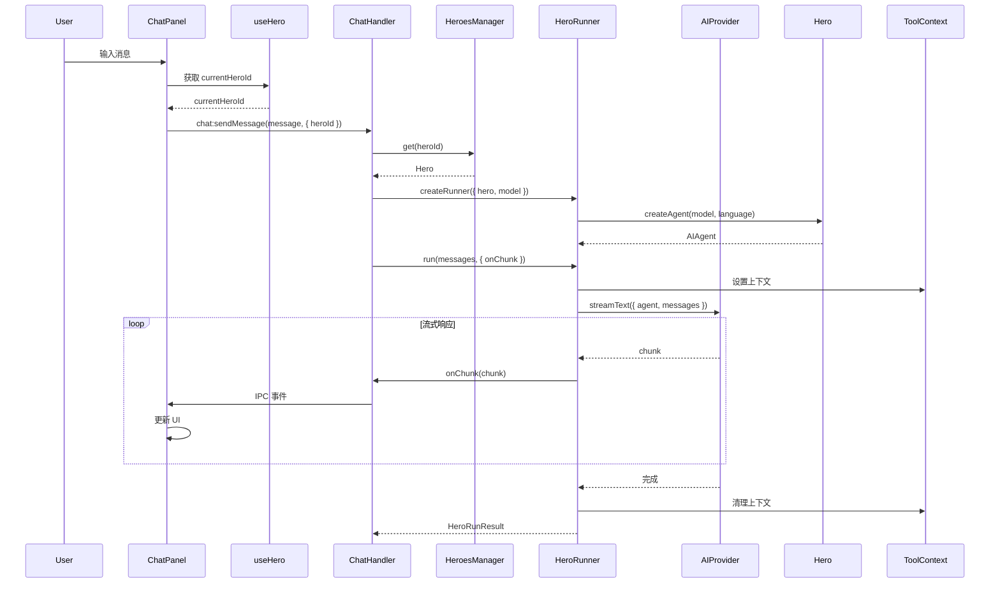
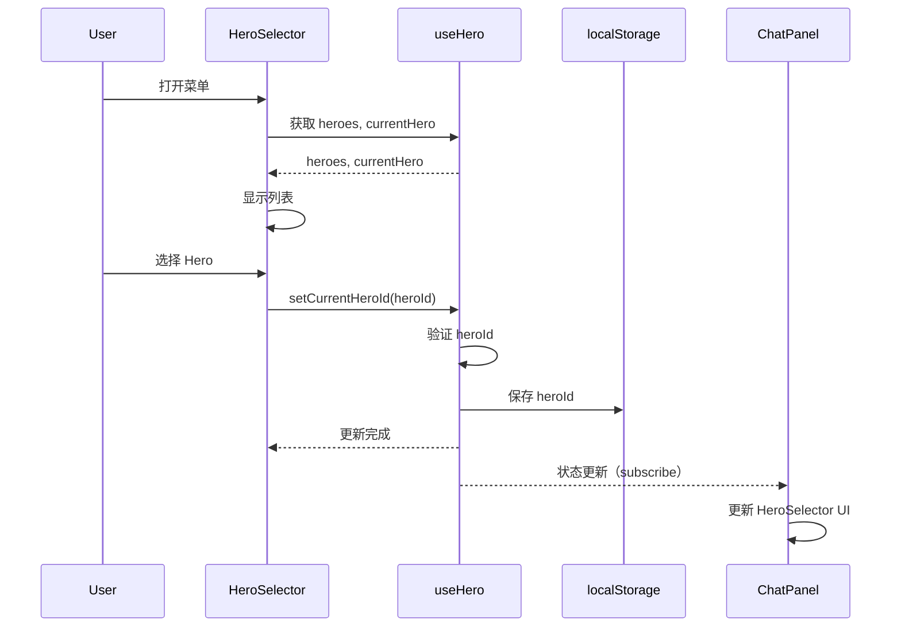
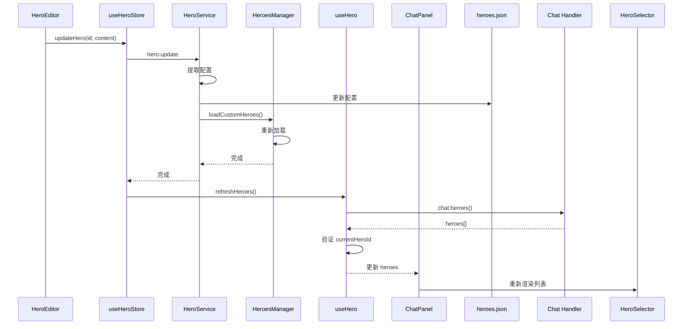

# Hero 聊天集成

## 概述

Hero 系统与聊天系统深度集成，用户可以为每个对话选择不同的 Hero，每个 Hero 会根据其配置（系统提示词、工具集、工具策略）产生不同的对话体验。

## 架构概览

```
┌─────────────────────────────────────────────────────────┐
│                   聊天界面 (ChatPanel)                    │
│  ┌──────────────┐  ┌──────────────┐  ┌──────────────┐  │
│  │HeroSelector  │  │ MessageList  │  │ InputBox     │  │
│  │ (切换 Hero)  │  │  (消息列表)  │  │  (输入框)    │  │
│  └──────────────┘  └──────────────┘  └──────────────┘  │
└──────────────────────┬──────────────────────────────────┘
                       │ useHero Hook
┌──────────────────────┴──────────────────────────────────┐
│                   状态管理层                              │
│              useHeroStore (Zustand)                      │
│   - heroes: HeroInfo[]                                   │
│   - currentHeroId: string                                │
│   - localStorage 持久化                                   │
└──────────────────────┬──────────────────────────────────┘
                       │ IPC
┌──────────────────────┴──────────────────────────────────┐
│                   Chat Handler                           │
│              获取当前 Hero 并创建对话                     │
└──────────────────────┬──────────────────────────────────┘
                       │
┌──────────────────────┴──────────────────────────────────┐
│                  HeroRunner                              │
│         创建 AI Agent 并执行对话                          │
└──────────────────────┬──────────────────────────────────┘
                       │
┌──────────────────────┴──────────────────────────────────┐
│                   AI Provider                            │
│              OpenAI / DeepSeek / ...                     │
└─────────────────────────────────────────────────────────┘
```

## 前端集成

### HeroSelector 组件

**位置：** `package/src/renderer/lib/chat/item/HeroSelector.tsx`

**功能：** 聊天界面中的 Hero 切换器

**核心功能：**

1. 显示当前选中的 Hero（头像 + 名称）
2. Popover 菜单列出所有可用 Hero
3. 点击头像查看 Hero 详情
4. 切换 Hero 时自动保存到 localStorage

**代码结构：**

```tsx
export const HeroSelector: React.FC<HeroSelectorProps> = ({
  open,
  onOpenChange,
  heroes,
  currentHero,
  onSelect,
}) => {
  const { t, i18n } = useTranslation();
  const locale: LocaleLike = i18n.language?.startsWith("zh") ? "zh" : "en";

  const handleSelectAgent = useCallback((agentId: string) => {
    onSelect(agentId);
    onOpenChange(false);
  }, [onSelect, onOpenChange]);

  return (
    <Popover open={open} onOpenChange={onOpenChange}>
      <PopoverTrigger asChild>
        <Button className="h-6 gap-1.5 pl-0 pr-2 text-xs rounded-full">
          <CachedAvatar
            src={currentHero?.avatar}
            heroId={currentHero?.id || "maria"}
            className="size-5 rounded-full"
          />
          <span className="max-w-20 truncate">
            {currentHero?.name || "默认"}
          </span>
        </Button>
      </PopoverTrigger>

      <PopoverContent side="bottom" align="start" className="w-64">
        <div className="space-y-2">
          <div className="px-2 py-1">
            <h4 className="text-xs font-medium">选择 Hero</h4>
            <p className="text-[10px] text-muted-foreground">
              每个 Hero 都有独特的个性
            </p>
          </div>

          <div className="max-h-[50vh] space-y-1 overflow-y-auto">
            {heroes.map((agent) => (
              <div
                key={agent.id}
                className={cn(
                  "w-full rounded-xl px-2 py-2 flex items-start gap-2 cursor-pointer",
                  agent.id === currentHero?.id
                    ? "bg-primary/10 text-primary"
                    : "hover:bg-muted"
                )}
                onClick={() => handleSelectAgent(agent.id)}
              >
                <CachedAvatar
                  src={agent.avatar}
                  heroId={agent.id}
                  className="size-7 rounded-full"
                  onClick={(e) => {
                    e.stopPropagation();
                    // 显示 Hero 详情对话框
                    dialog({
                      title: agent.name,
                      content: () => <HeroDetailDialog agent={agent} />
                    });
                  }}
                />

                <div className="min-w-0 flex-1">
                  <div className="text-[11px] font-medium truncate">
                    {agent.name}
                  </div>
                  <div className="text-[10px] text-muted-foreground line-clamp-2">
                    {getPrompt(agent.description, locale)}
                  </div>
                </div>
              </div>
            ))}
          </div>
        </div>
      </PopoverContent>
    </Popover>
  );
};
```

### useHero Hook

**位置：** `package/src/renderer/hooks/chat/useHero.ts`

**功能：** 管理聊天中的 Hero 选择状态

**核心特性：**

1. 自动加载 Hero 列表（包含内置 + 自定义）
2. 持久化当前选中的 Hero ID 到 localStorage
3. 验证 Hero ID 有效性
4. 防止重复加载

**状态管理：**

```typescript
export const useHeroStore = create<HeroStore>()(
  subscribeWithSelector((set, get) => ({
    heroes: [],
    currentHeroId: (() => {
      // 从 localStorage 读取上次选中的 Hero
      return window.localStorage.getItem("vibecape.ai.hero") || "nova";
    })(),
    loaded: false,
    loading: false,

    setCurrentHeroId: (id: string) => {
      const { heroes, currentHeroId } = get();

      // 避免无意义的更新
      if (id === currentHeroId) return;

      // 验证 id 是否有效
      if (heroes.length > 0 && !heroes.some((h) => h.id === id)) {
        console.warn("Invalid heroId:", id);
        return;
      }

      set({ currentHeroId: id });

      // 持久化到 localStorage
      window.localStorage.setItem("vibecape.ai.hero", id);
    },

    loadHeroes: async () => {
      const { loaded, loading } = get();

      // 防止重复加载
      if (loaded || loading) return;

      set({ loading: true });

      try {
        const heroes = await window.api.chat.heroes();
        const { currentHeroId } = get();

        // 验证当前 heroId 是否有效
        const isValidHeroId = heroes.some((h) => h.id === currentHeroId);
        const finalHeroId = isValidHeroId
          ? currentHeroId
          : heroes[0]?.id || "nova";

        set({
          heroes,
          currentHeroId: finalHeroId,
          loaded: true,
          loading: false,
        });

        // 如果 heroId 被重置，更新 localStorage
        if (!isValidHeroId && finalHeroId !== currentHeroId) {
          window.localStorage.setItem("vibecape.ai.hero", finalHeroId);
        }
      } catch (error) {
        console.error("加载 Heroes 失败:", error);
        set({ loading: false });
      }
    },

    refreshHeroes: async () => {
      // 强制刷新，忽略防重复加载
      set({ loading: true });

      try {
        const heroes = await window.api.chat.heroes();
        const { currentHeroId } = get();

        const isValidHeroId = heroes.some((h) => h.id === currentHeroId);
        const finalHeroId = isValidHeroId
          ? currentHeroId
          : heroes[0]?.id || "nova";

        set({
          heroes,
          currentHeroId: finalHeroId,
          loaded: true,
          loading: false,
        });
      } catch (error) {
        console.error("刷新 Heroes 失败:", error);
        set({ loading: false });
      }
    },

    getCurrentHero: () => {
      const { heroes, currentHeroId } = get();
      return heroes.find((h) => h.id === currentHeroId) || heroes[0];
    },
  }))
);

// 使用 Hook
export function useHero() {
  const { heroes, currentHeroId, loaded, loading } = useHeroStore(
    useShallow((state) => ({
      heroes: state.heroes,
      currentHeroId: state.currentHeroId,
      loaded: state.loaded,
      loading: state.loading,
    }))
  );

  const setCurrentHeroId = useHeroStore((state) => state.setCurrentHeroId);
  const loadHeroes = useHeroStore((state) => state.loadHeroes);
  const refreshHeroes = useHeroStore((state) => state.refreshHeroes);

  // 自动加载 Heroes
  useEffect(() => {
    void loadHeroes();
  }, [loadHeroes]);

  const currentHero = useHeroStore((state) => state.getCurrentHero());

  return {
    heroes,
    currentHero,
    currentHeroId,
    setCurrentHeroId,
    loaded,
    loading,
    refreshHeroes,
  };
}
```

### ChatPanel 集成

**在 ChatPanel 中使用 Hero：**

```tsx
import { useHero } from "@/hooks/chat/useHero";
import { HeroSelector } from "@/lib/chat/item/HeroSelector";

export function ChatPanel() {
  const {
    heroes,
    currentHero,
    currentHeroId,
    setCurrentHeroId,
  } = useHero();

  const [heroSelectorOpen, setHeroSelectorOpen] = useState(false);

  const handleSendMessage = async (message: string) => {
    // 使用当前选中的 Hero 发送消息
    await window.api.chat.sendMessage(message, {
      heroId: currentHeroId,
    });
  };

  return (
    <div className="flex flex-col h-full">
      {/* 头部：Hero 选择器 */}
      <div className="flex items-center gap-2 p-2 border-b">
        <HeroSelector
          open={heroSelectorOpen}
          onOpenChange={setHeroSelectorOpen}
          heroes={heroes}
          currentHero={currentHero}
          onSelect={setCurrentHeroId}
        />
      </div>

      {/* 消息列表 */}
      <MessageList />

      {/* 输入框 */}
      <InputBox onSend={handleSendMessage} />
    </div>
  );
}
```

## 后端集成

### Chat Handler

**位置：** `package/src/main/handler/chat.ts`

**功能：** 处理聊天消息，获取当前 Hero 并创建对话

**核心流程：**

1. 接收前端发送的消息和 heroId
2. 从 HeroesManager 获取对应的 Hero
3. 创建 HeroRunner 实例
4. 执行对话并流式返回响应

**代码结构：**

```typescript
// package/src/main/handler/chat.ts

createHandler("chat:sendMessage").handle(
  async (ctx, message: string, options: { heroId?: string }) => {
    const repoId = getCurrentRepoId();

    // 获取 Hero
    const heroId = options?.heroId || "nova";
    const hero = HeroesManager.get(heroId);
    if (!hero) {
      throw new Error(`Hero "${heroId}" not found`);
    }

    // 获取线程历史
    const threadId = options?.threadId;
    const history = await getThreadHistory(threadId);

    // 构建 AI 模型
    const model = createModel(repoId);

    // 创建 HeroRunner
    const runner = createHeroRunner({
      hero,
      model,
      additionalTools: {
        // 添加文档相关工具
        ...createDocReaderTools(repoId),
        ...createDocEditorTools(repoId),
        ...createDocManagementTools(repoId),
      },
    });

    // 执行对话
    const result = await runner.run(history, {
      threadId,
      language: ctx.language || "zh",
      onChunk: (chunk) => {
        // 流式传输到前端
        sendChunkToRenderer(threadId, chunk);
      },
    });

    return result;
  }
);

// 获取可用的 Hero 列表
createHandler("chat:heroes").handle(async () => {
  return HeroesManager.getAllMetas();
});
```

### HeroRunner 执行

**位置：** `package/src/main/context/HeroRunner.ts`

**功能：** 执行 Hero 对话，处理工具调用

**执行流程：**

```typescript
async run(
  messages: ModelMessage[],
  options: {
    threadId?: string;
    language?: "en" | "zh";
    onChunk?: (chunk: unknown) => void;
    abortSignal?: AbortSignal;
  } = {}
): Promise<HeroRunResult> {
  const startTime = Date.now();
  const toolCalls: HeroRunResult["toolCalls"] = [];
  let outputText = "";
  let reasoningText = "";

  // 获取系统提示词
  const systemPrompt = this.hero.getSystemPrompt(options.language ?? "zh");

  // 设置 ToolContext
  ToolContext.set({
    threadId: options.threadId,
    messages,
    currentInput: getLastUserMessage(messages),
    systemPrompt,
    heroId: this.hero.id,
  });

  try {
    const result = streamText({
      model: this.model,
      messages,
      tools: this.tools,
      abortSignal: options.abortSignal,
      stopWhen: stepCountIs(this.maxSteps),

      onChunk: ({ chunk }) => {
        if (chunk.type === "text-delta") {
          outputText += chunk.text;
        } else if (chunk.type === "reasoning-delta") {
          reasoningText += (chunk as { text?: string }).text || "";
        } else if (chunk.type === "tool-call") {
          const toolName = (chunk as { toolName?: string }).toolName || "unknown";
          const toolInput = (chunk as { input?: unknown }).input;
          toolCalls.push({
            name: toolName,
            input: toolInput,
            output: undefined,
            duration: 0,
          });
        } else if (chunk.type === "tool-result") {
          const lastTool = toolCalls[toolCalls.length - 1];
          if (lastTool) {
            lastTool.output = (chunk as { output?: unknown }).output;
          }
        }

        // 转发 chunk 到前端
        options.onChunk?.(chunk);
      },
    });

    await result.consumeStream();
    outputText = await result.text;

    const duration = Date.now() - startTime;

    return {
      text: outputText,
      reasoning: reasoningText,
      toolCalls,
      subagentResults: [],
      tokenUsage: {
        input: estimateTokens(messages),
        output: estimateTokens(outputText),
        total: 0,
      },
      duration,
    };
  } finally {
    ToolContext.clear();
  }
}
```

## 数据流

### 发送消息流程



### 切换 Hero 流程



### 创建/更新 Hero 后刷新



## Hero 对话特性

### 1. 系统提示词

每个 Hero 有自己的系统提示词，根据语言自动切换：

```typescript
const hero = HeroesManager.get("nova");
const prompt = hero.getSystemPrompt("zh"); // 中文
// 或
const prompt = hero.getSystemPrompt("en"); // 英文
```

### 2. 工具调用

Hero 可以使用不同的工具集：

```typescript
const runner = createHeroRunner({
  hero,
  model,
  additionalTools: {
    // 文档工具
    ...createDocReaderTools(repoId),
    ...createDocEditorTools(repoId),
    // 待办工具
    ...createTodoTools(repoId),
  },
});
```

工具选择策略：

- `auto`：AI 自动决定
- `required`：必须使用工具
- `none`：不使用工具

### 3. 最大步数

限制 Hero 的最大执行步数：

```typescript
const hero = new Hero({
  maxSteps: 20, // 最多执行 20 步
  // ...
});

// 或在运行时覆盖
const runner = createHeroRunner({
  hero,
  model,
  maxSteps: 10, // 覆盖为 10 步
});
```

### 4. 多语言支持

Hero 支持中英文双语：

```typescript
interface BilingualPrompt {
  en: string;
  zh: string;
}

const hero = new Hero({
  description: {
    en: "Your intelligent assistant",
    zh: "你的智能助手",
  },
  prompt: {
    en: "You are a helpful assistant...",
    zh: "你是一个有用的助手...",
  },
});
```

## Hero 建议（Suggestions）

Hero 可以提供快速开始的建议预设：

```typescript
const hero = new Hero({
  suggestions: [
    {
      title: {
        en: "Help me write",
        zh: "帮我写作",
      },
      prompt: {
        en: "Can you help me improve my writing?",
        zh: "能帮我改进这段文字吗？",
      },
    },
  ],
});
```

在聊天界面中显示建议：

```tsx
{currentHero?.suggestions && currentHero.suggestions.length > 0 && (
  <div className="flex gap-2 flex-wrap">
    {currentHero.suggestions.map((suggestion, index) => (
      <Button
        key={index}
        variant="outline"
        size="sm"
        onClick={() => {
          const prompt = getPrompt(suggestion.prompt, locale);
          handleSendMessage(prompt);
        }}
      >
        {getPrompt(suggestion.title, locale)}
      </Button>
    ))}
  </div>
)}
```

## 欢迎消息（Welcome）

Hero 可以设置新对话的欢迎消息：

```typescript
const hero = new Hero({
  welcome: {
    en: "Hi! I'm Nova. How can I help you today?",
    zh: "你好！我是 Nova。今天有什么可以帮你的吗？",
  },
});
```

在新对话中显示：

```tsx
{messages.length === 0 && currentHero?.welcome && (
  <div className="text-center text-muted-foreground">
    {getPrompt(currentHero.welcome, locale)}
  </div>
)}
```

## 工具调用示例

### Hero 配置

```typescript
const hero = new Hero({
  id: "doc-editor",
  name: "文档编辑器",
  prompt: {
    zh: "你是一个文档编辑助手，可以帮用户编辑和改进文档。",
  },
  tools: {
    // 文档读取工具
    getCurrentDoc: {
      description: "获取当前文档内容",
      parameters: z.object({}),
      execute: async () => {
        return await getCurrentDocContent();
      },
    },
    // 文档编辑工具
    updateNodes: {
      description: "更新文档节点",
      parameters: z.object({
        operations: z.array(z.object({
          type: z.enum(["update", "insert", "delete"]),
          path: z.array(z.union([z.string(), z.number()])),
          content: z.any().optional(),
        })),
      }),
      execute: async ({ operations }) => {
        return await updateDocumentNodes(operations);
      },
    },
  },
  toolChoice: "auto", // AI 自动决定是否使用工具
  maxSteps: 20,
});
```

### 对话示例

```
User: 帮我把当前文档的开头改得更吸引人一些

Hero: 我来帮你改进文档开头。首先让我看一下当前的内容。

[调用工具 getCurrentDoc]

Hero: 我看到了文档内容。我可以将开头从：
"这是一个关于..." 改为：
"在当今快速发展的时代，..."

[调用工具 updateNodes]

Hero: 已完成修改！新的开头更吸引人了。你可以查看效果，如果需要进一步调整请告诉我。
```

## 性能优化

### 1. Hero 缓存

HeroesManager 在内存中缓存所有 Hero 实例：

```typescript
class HeroesManagerClass {
  private heroes = new Map<string, Hero>();

  get(id: string): Hero | undefined {
    return this.heroes.get(id);
  }
}
```

### 2. 防重复加载

useHero Hook 防止重复加载 Hero 列表：

```typescript
loadHeroes: async () => {
  const { loaded, loading } = get();

  // 防止重复加载
  if (loaded || loading) return;

  set({ loading: true });
  // ...
}
```

### 3. 乐观更新

updateHero 使用乐观更新，避免重新加载：

```typescript
updateHero: async (id, content) => {
  await window.api.hero.update(id, content);

  // 只更新本地状态
  set((state) => ({
    heroes: state.heroes.map((h) =>
      h.id === id ? { ...h, body: content } : h
    ),
  }));
}
```

### 4. 流式响应

HeroRunner 使用流式响应，提升用户体验：

```typescript
const result = streamText({
  model: this.model,
  messages,
  tools: this.tools,

  onChunk: ({ chunk }) => {
    // 立即转发到前端
    options.onChunk?.(chunk);
  },
});
```

## 相关文档

- [系统架构](./overview) - Hero 系统的整体架构
- [数据模型](./data-model) - Hero 的数据结构和存储
- [前端实现](./frontend) - Hero 的 UI 组件和状态管理
- [后端实现](./backend) - Hero 的服务和处理器
