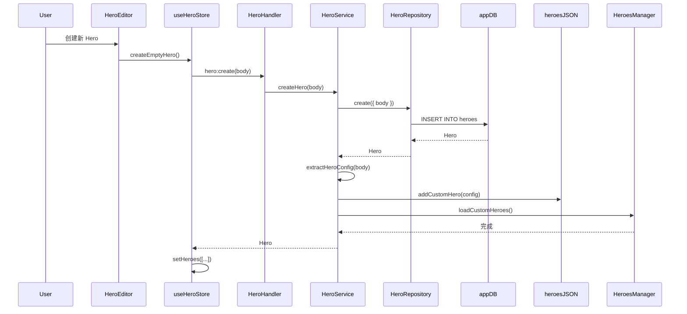
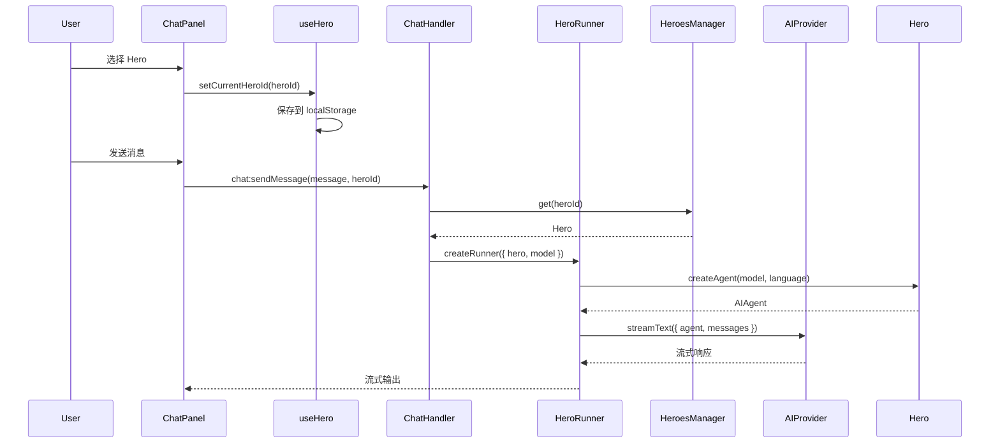

# Hero 数据模型

## 概述

Hero 系统使用多种存储方式来管理 Hero 配置和运行时状态：

1. **app.db (SQLite)**：持久化存储自定义 Hero
2. **heroes.json**：运行时配置缓存
3. **代码注册**：内置 Hero 在应用启动时注册
4. **文件系统**：Hero 头像图片

## 数据库模型

### heroes 表

自定义 Hero 存储在 `app.db` 的 `heroes` 表中：

```sql
-- 位置: ~/vibecape/app.db

CREATE TABLE heroes (
  id TEXT PRIMARY KEY,           -- Hero ID (24 字符)
  body TEXT NOT NULL DEFAULT '', -- Tiptap JSONContent 格式的配置
  created_at INTEGER NOT NULL,   -- 创建时间 (timestamp)
  updated_at INTEGER NOT NULL    -- 更新时间 (timestamp)
);
```

**字段说明：**

- `id`：Hero 的唯一标识符，24 字符字符串（使用 nanoid 生成）
- `body`：Hero 的完整配置，以 Tiptap JSONContent 格式存储
- `created_at`：创建时间戳
- **updated_at**：最后更新时间戳

**TypeScript 类型定义：**

```typescript
// package/src/common/schema/app.ts

export const heroes = sqliteTable("heroes", {
  id: id("id", { length: 24 }),
  body: text("body").notNull().default(""),
  created_at: integer("created_at", { mode: "timestamp" })
    .notNull()
    .$defaultFn(() => new Date()),
  updated_at: integer("updated_at", { mode: "timestamp" })
    .notNull()
    .$defaultFn(() => new Date()),
});

export type Hero = typeof heroes.$inferSelect;
export type HeroInsert = typeof heroes.$inferInsert;
```

### body 字段结构

`body` 字段存储的是 Tiptap 的 JSONContent 格式，包含 Hero 的所有信息：

```json
{
  "type": "doc",
  "content": [
    {
      "type": "heroName",
      "content": [
        { "type": "text", "text": "我的自定义 Hero" }
      ]
    },
    {
      "type": "heroDescription",
      "content": [
        { "type": "text", "text": "这是一个专业的写作助手" }
      ]
    },
    {
      "type": "paragraph",
      "content": [
        { "type": "text", "text": "你是一个专业的写作助手，擅长..." }
      ]
    },
    {
      "type": "heroToolChoice",
      "attrs": {
        "toolChoice": "auto"
      }
    }
  ]
}
```

**节点类型：**

1. **heroName**：Hero 名称（渲染为 `<h1>`）
2. **heroDescription**：Hero 描述（渲染为斜体段落）
3. **paragraph**：系统提示词内容（普通段落）
4. **heroToolChoice**：工具选择策略（存储在 attrs 中）

## JSON 配置文件

### heroes.json

位置：`~/vibecape/heroes.json`

这个文件存储自定义 Hero 的运行时配置，由 `HeroService` 自动同步：

```json
{
  "custom": [
    {
      "id": "hero-1234567890ab",
      "name": "写作助手",
      "description": {
        "en": "A professional writing assistant",
        "zh": "一个专业的写作助手"
      },
      "avatar": "vibecape://assets/avatars/hero-1234567890ab.png",
      "prompt": {
        "en": "You are a professional writing assistant...",
        "zh": "你是一个专业的写作助手..."
      },
      "maxSteps": 20,
      "enabled": true,
      "isDefault": false
    }
  ]
}
```

**TypeScript 类型定义：**

```typescript
// package/src/common/schema/config.ts

export interface HeroesConfig {
  custom: CustomHeroConfig[];
}

export interface CustomHeroConfig {
  id: string;
  name: string;
  description: BilingualPrompt;
  avatar: string;
  prompt: BilingualPrompt;
  maxSteps?: number;
  enabled: boolean;
  isDefault?: boolean;
  welcome?: BilingualPrompt;
  suggestions?: HeroSuggestion[];
}
```

**同步机制：**

当用户通过 `HeroEditor` 修改 Hero 时：

1. `useHeroStore.updateHero()` 保存到 `app.db`
2. `HeroService.updateHero()` 提取配置并同步到 `heroes.json`
3. `HeroesManager.loadCustomHeroes()` 重新加载
4. UI 刷新

## 代码中的 Hero 定义

### 内置 Hero

内置 Hero 在代码中直接定义，不存储在数据库中：

```typescript
// package/src/main/heroes/presets/nova/index.ts

import { Hero } from "../../Hero";
import { buildPrompt } from "../common";
import info from "./info.json";
import roleEn from "./role.en.txt?raw";
import roleZh from "./role.zh.txt?raw";

const prompt = buildPrompt({
  role: { en: roleEn, zh: roleZh },
  features: ["thinking", "uncertainty", "context", "references", "tools"],
});

export const nova = new Hero({
  ...info,
  prompt,
  tools: {},
  maxSteps: 20,
  isDefault: true,
});
```

**info.json 示例：**

```json
{
  "id": "nova",
  "name": "Nova",
  "description": {
    "en": "Your intelligent assistant for everything",
    "zh": "你的全能智能助手"
  },
  "avatar": "https://api.dicebear.com/7.x/bottts/svg?seed=Nova",
  "welcome": {
    "en": "Hi! I'm Nova. How can I help you today?",
    "zh": "你好！我是 Nova。今天有什么可以帮你的吗？"
  },
  "suggestions": [
    {
      "title": { "en": "Help me write", "zh": "帮我写作" },
      "prompt": {
        "en": "Can you help me improve my writing?",
        "zh": "能帮我改进这段文字吗？"
      }
    }
  ]
}
```

### Hero 类

```typescript
// package/src/main/heroes/Hero.ts

export class Hero {
  readonly id: string;
  readonly name: string;
  readonly description: BilingualPrompt;
  readonly avatar: string;
  readonly prompt: BilingualPrompt;
  readonly tools: Record<string, Tool>;
  readonly maxSteps: number;
  readonly toolChoice: HeroConfig["toolChoice"];
  readonly isDefault: boolean;
  readonly welcome?: BilingualPrompt;
  readonly suggestions?: HeroSuggestion[];

  constructor(config: HeroConfig) {
    // 初始化所有属性
  }

  /** 获取元数据（用于 UI 展示） */
  getMeta(): HeroMeta {
    return {
      id: this.id,
      name: this.name,
      description: this.description,
      avatar: this.avatar,
      isDefault: this.isDefault,
      welcome: this.welcome,
      suggestions: this.suggestions,
    };
  }

  /** 根据语言获取系统提示词 */
  getSystemPrompt(language: LocaleLike = "en"): string {
    const lang = normalizeLanguage(language);
    return this.prompt[lang] || this.prompt.en;
  }

  /** 创建 AI SDK Agent 实例 */
  createAgent(
    model: LanguageModel,
    language: LocaleLike = "en"
  ): AIAgent<Record<string, Tool>> {
    const lang = normalizeLanguage(language);
    return new AIAgent({
      model,
      system: this.getSystemPrompt(lang),
      tools: this.tools,
      stopWhen: stepCountIs(this.maxSteps),
      toolChoice: this.toolChoice,
    });
  }
}
```

## 文件系统存储

### Hero 头像

**位置：** `~/vibecape/assets/avatars/`

**命名规则：** `{heroId}.png`

**下载机制：**

1. 创建 Hero 时，`HeroService` 自动生成头像 URL
2. 使用 `https://avatar.iran.liara.run/public/{gender}?username={heroId}` 作为源
3. 异步下载到本地，存储为 `{heroId}.png`
4. 后续使用 `vibecape://assets/avatars/{heroId}.png` 本地路径

**代码示例：**

```typescript
// package/src/main/services/HeroService.ts

function getOrDownloadAvatar(heroId: string): string {
  const exists = avatarExistsSync(heroId);

  if (exists) {
    return `vibecape://assets/avatars/${heroId}.png`;
  }

  // 异步下载
  downloadAvatarAsync(heroId).catch((error) => {
    console.error("Async avatar download failed:", error);
  });

  // 返回远程 URL 作为 fallback
  const gender = getAvatarGender(heroId);
  return `https://avatar.iran.liara.run/public/${gender}?username=${heroId}`;
}
```

## 数据流

### 创建 Hero



### 使用 Hero



## 数据一致性

### 同步策略

Hero 系统采用"数据库为主，JSON 为辅"的同步策略：

1. **app.db** 是唯一真实数据源（Single Source of Truth）
2. **heroes.json** 是运行时缓存，由 `HeroService` 自动同步
3. **HeroesManager** 在启动和变更时重新加载

### 防止数据不一致

- 所有的 Hero 创建、更新、删除都通过 `HeroService` 进行
- `HeroService` 保证数据库和 JSON 文件的同步
- `HeroesManager.loadCustomHeroes()` 在每次变更后调用

### 数据验证

```typescript
// package/src/main/services/HeroService.ts

async createHero(body: string): Promise<Hero> {
  // 验证 JSON 格式
  try {
    JSON.parse(body);
  } catch (error) {
    throw new Error("无效的 JSON 格式");
  }

  // 创建数据库记录
  const hero = await heroRepository.create({ body });

  // 同步到配置
  try {
    const heroConfig = await extractHeroConfig(hero.id, hero.body);
    addCustomHero(heroConfig);
    HeroesManager.loadCustomHeroes();
  } catch (error) {
    console.error("Failed to sync hero to config:", error);
  }

  return hero;
}
```

## 相关文档

- [系统架构](./overview) - Hero 系统的整体架构
- [前端实现](./frontend) - Hero 的 UI 组件和状态管理
- [后端实现](./backend) - Hero 的服务和处理器
