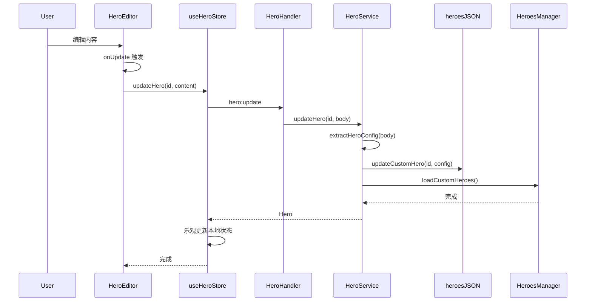
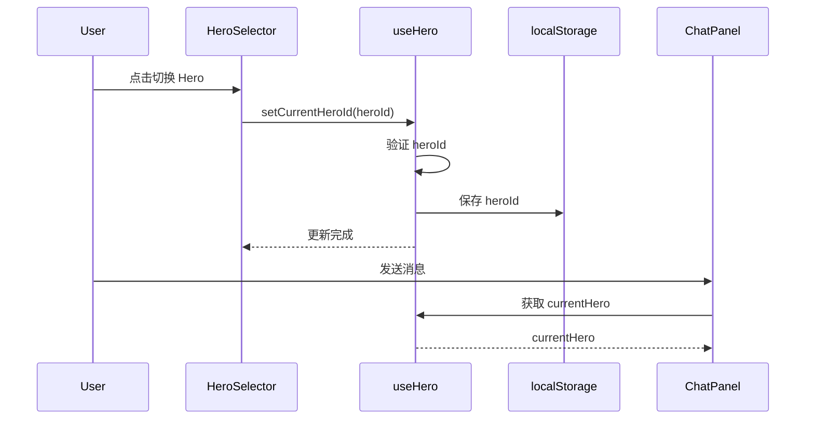

# Hero 前端实现

## 概述

Hero 系统的前端由多个组件和状态管理模块组成，负责 Hero 的展示、编辑和选择。

## 核心组件

### 1. HeroSidebar

**位置：** `package/src/renderer/layouts/sidebar/hero/HeroSidebar.tsx`

**功能：** 显示 Hero 列表，支持创建、选择和删除操作

**主要特性：**

- 显示所有自定义 Hero
- 提取 Hero 名称和描述（从 body JSON 中解析）
- 支持创建新 Hero（空内容）
- 支持删除 Hero（带确认）
- 空状态提示
- 与 `useHeroStore` 集成

**代码结构：**

```tsx
export function HeroSidebar() {
  const {
    heroes,           // Hero 列表
    selectedHeroId,   // 当前选中的 Hero ID
    isLoading,        // 加载状态
    loadHeroes,       // 加载 Hero 列表
    setSelectedHeroId,// 设置选中的 Hero
    createEmptyHero,  // 创建空 Hero
    deleteHero,       // 删除 Hero
  } = useHeroStore();

  const { refreshHeroes } = useHero(); // 刷新 ChatPanel 的 Hero 列表

  useEffect(() => {
    loadHeroes();
  }, [loadHeroes]);

  // 创建 Hero
  const handleCreate = async () => {
    await createEmptyHero();
    toast.success("Hero 已创建");
    await refreshHeroes();
  };

  // 删除 Hero
  const handleDelete = async (heroId: string) => {
    await deleteHero(heroId);
    toast.success("Hero 已删除");
    await refreshHeroes();
  };

  return (
    <div className="flex flex-col h-full">
      {/* 头部：新建按钮 */}
      <div className="p-xs">
        <Button onClick={handleCreate}>
          <Plus />
          新建 Hero
        </Button>
      </div>

      {/* 列表区域 */}
      <div className="flex-1 overflow-auto space-y-0.5">
        {heroes.map((hero) => (
          <HeroNode
            key={hero.id}
            hero={hero}
            isSelected={selectedHeroId === hero.id}
            onSelect={() => setSelectedHeroId(hero.id)}
            onDelete={() => handleDelete(hero.id)}
          />
        ))}
      </div>
    </div>
  );
}
```

**HeroNode 组件：**

```tsx
const HeroNode = memo(({ hero, isSelected, onSelect, onDelete }) => {
  // 从 body JSON 中提取名称
  const name = useMemo(() => {
    try {
      const content = JSON.parse(hero.body);
      const nameNode = content.content?.find(
        (node: any) => node.type === "heroName"
      );
      return nameNode?.content?.map((n: any) => n.text).join("") || "新 Hero";
    } catch {
      return "新 Hero";
    }
  }, [hero.body]);

  // 从 body JSON 中提取描述
  const description = useMemo(() => {
    try {
      const content = JSON.parse(hero.body);
      const descNode = content.content?.find(
        (node: any) => node.type === "heroDescription"
      );
      return descNode?.content?.map((n: any) => n.text).join("") || "";
    } catch {
      return "";
    }
  }, [hero.body]);

  return (
    <div
      className={cn(
        "group flex items-center gap-1 p-1 rounded-lg",
        "hover:bg-muted-foreground/5",
        isSelected && "bg-primary/5"
      )}
      onClick={onSelect}
    >
      <Button size="icon">
        <Bot />
      </Button>

      <div className="flex-1 min-w-0">
        <div className="text-xs font-medium truncate">{name}</div>
        {description && (
          <div className="text-xs text-muted-foreground truncate">
            {description}
          </div>
        )}
      </div>

      {/* 删除菜单 */}
      <DropdownMenu>
        <DropdownMenuTrigger asChild>
          <Button
            size="icon"
            className="opacity-0 group-hover:opacity-100"
          >
            <MoreHorizontal />
          </Button>
        </DropdownMenuTrigger>
        <DropdownMenuContent>
          <DropdownMenuItem onClick={onDelete} className="text-destructive">
            <Trash2 />
            删除
          </DropdownMenuItem>
        </DropdownMenuContent>
      </DropdownMenu>
    </div>
  );
});
```

### 2. HeroEditor

**位置：** `package/src/renderer/layouts/mainview/hero/HeroEditor.tsx`

**功能：** 基于 Tiptap 的可视化编辑器，使用自定义节点编辑 Hero

**主要特性：**

- 使用 Tiptap 富文本编辑器
- 自定义节点：`heroName`、`heroDescription`、`heroToolChoice`
- Slash Command 菜单（输入 `/` 触发）
- 自动保存（500ms debounce）
- 自动聚焦（新 Hero 聚焦开头，编辑聚焦末尾）

**代码结构：**

```tsx
export function HeroEditor({ hero, onChange, onSave }: HeroEditorProps) {
  const { t } = useTranslation();
  const containerRef = useRef<HTMLDivElement>(null);

  // Debounced save（500ms）
  const debouncedSave = useMemo(
    () => debounce((content: JSONContent) => {
      onSaveRef.current?.(content);
    }, 500),
    []
  );

  // Slash Menu 配置
  const heroSlashMenuConfig = useMemo(
    () => createHeroSlashMenuPlugin(t),
    [t]
  );

  // 初始内容
  const initialContent = useMemo(() => {
    if (hero?.body) {
      try {
        return JSON.parse(hero.body);
      } catch {
        return createEmptyHeroContent();
      }
    }
    return createEmptyHeroContent();
  }, [hero?.id, hero?.body]);

  // Tiptap 编辑器
  const editor = useEditor({
    extensions: [
      StarterKit.configure({
        heading: false,
        bulletList: false,
        orderedList: false,
        // 禁用不需要的节点
      }),
      HeroName,
      HeroDescription,
      HeroToolChoice,
      Placeholder.configure({
        placeholder: ({ node }) => {
          if (node.type.name === "heroName") return "Hero Name";
          if (node.type.name === "heroDescription") return "描述";
          return "输入 '/' 命令...";
        },
      }),
      SlashCommand.configure({
        suggestion: heroSlashMenuConfig,
      }),
      CustomKeyboardExtension,
    ],
    content: initialContent,
    editorProps: {
      attributes: {
        class: "prose prose-sm max-w-none focus:outline-none min-h-full",
      },
    },
    onUpdate: ({ editor }) => {
      const content = editor.getJSON();
      onChangeRef.current?.(content);
      debouncedSave(content); // 自动保存
    },
  }, [hero?.id]);

  // 自动聚焦逻辑
  useEffect(() => {
    if (!editor || !editor.isEditable) return;

    const timer = setTimeout(() => {
      const docContent = editor.getJSON();
      const content = docContent.content || [];

      // 空文档聚焦开头
      if (content.length === 0 ||
          (content.length === 1 && content[0]?.type === "paragraph" &&
           (!content[0]?.content || content[0]?.content.length === 0))) {
        editor.commands.focus("start");
      } else {
        // 否则聚焦末尾
        editor.commands.focus("end");
      }
    }, 0);

    return () => clearTimeout(timer);
  }, [editor, hero?.id]);

  return (
    <div
      ref={containerRef}
      className="relative flex-1 min-h-0 cursor-text flex flex-col"
      onClick={(e) => {
        // 点击底部空白区域聚焦到编辑器末尾
        if (e.target === containerRef.current) {
          editor?.commands.focus("end");
        }
      }}
    >
      <div className="flex-1 p-4 overflow-y-auto">
        <EditorContent editor={editor} />
      </div>
    </div>
  );
}
```

### 3. HeroView

**位置：** `package/src/renderer/layouts/mainview/hero/HeroView.tsx`

**功能：** Hero 编辑器的容器组件

**代码结构：**

```tsx
export const HeroView = () => {
  const { t } = useTranslation();
  const { heroes, selectedHeroId, updateHero } = useHeroStore();
  const { refreshHeroes } = useHero();

  // 选中 Hero 时显示编辑器
  if (selectedHeroId) {
    const selectedHero = heroes.find((h) => h.id === selectedHeroId) || null;
    return (
      <div className="flex h-full w-full">
        <HeroEditor
          key={selectedHeroId}
          hero={selectedHero}
          onSave={async (content) => {
            const body = JSON.stringify(content);
            await updateHero(selectedHeroId, body);
            await refreshHeroes(); // 刷新 ChatPanel
          }}
        />
      </div>
    );
  }

  // 未选中 Hero 时显示空状态
  return (
    <div className="w-full flex h-full justify-center items-center">
      <div className="text-center space-y-4">
        <Bot className="w-16 h-16 mx-auto text-muted-foreground" />
        <p className="text-sm text-muted-foreground">
          选择或创建一个 Hero
        </p>
      </div>
    </div>
  );
};
```

### 4. HeroSelector

**位置：** `package/src/renderer/lib/chat/item/HeroSelector.tsx`

**功能：** 聊天界面中的 Hero 切换器

**主要特性：**

- 显示当前 Hero 头像和名称
- Popover 菜单显示所有 Hero
- 支持 Hero 详情预览（点击头像）
- 自动刷新 Hero 列表

**代码结构：**

```tsx
export const HeroSelector: React.FC<HeroSelectorProps> = ({
  open,
  onOpenChange,
  heroes,
  currentHero,
  onSelect,
}) => {
  const { t, i18n } = useTranslation();
  const locale: LocaleLike = i18n.language?.startsWith("zh") ? "zh" : "en";

  const handleSelectAgent = useCallback((agentId: string) => {
    onSelect(agentId);
    onOpenChange(false);
  }, [onSelect, onOpenChange]);

  return (
    <Popover open={open} onOpenChange={onOpenChange}>
      <PopoverTrigger asChild>
        <Button className="h-6 gap-1.5 pl-0 pr-2 text-xs rounded-full">
          <CachedAvatar
            src={currentHero?.avatar}
            heroId={currentHero?.id || "maria"}
            className="size-5 rounded-full"
          />
          <span className="max-w-20 truncate">
            {currentHero?.name || "默认"}
          </span>
        </Button>
      </PopoverTrigger>

      <PopoverContent side="bottom" align="start" className="w-64">
        <div className="space-y-2">
          <div className="px-2 py-1">
            <h4 className="text-xs font-medium">选择 Hero</h4>
            <p className="text-[10px] text-muted-foreground">
              每个 Hero 都有独特的个性
            </p>
          </div>

          <div className="max-h-[50vh] space-y-1 overflow-y-auto">
            {heroes.map((agent) => (
              <div
                key={agent.id}
                className={cn(
                  "w-full rounded-xl px-2 py-2 flex items-start gap-2 cursor-pointer",
                  agent.id === currentHero?.id
                    ? "bg-primary/10 text-primary"
                    : "hover:bg-muted"
                )}
                onClick={() => handleSelectAgent(agent.id)}
              >
                <CachedAvatar
                  src={agent.avatar}
                  heroId={agent.id}
                  className="size-7 rounded-full"
                  onClick={(e) => {
                    e.stopPropagation();
                    // 显示 Hero 详情对话框
                    dialog({
                      title: agent.name,
                      content: () => <HeroDetailDialog agent={agent} />
                    });
                  }}
                />

                <div className="min-w-0 flex-1">
                  <div className="text-[11px] font-medium truncate">
                    {agent.name}
                  </div>
                  <div className="text-[10px] text-muted-foreground line-clamp-2">
                    {getPrompt(agent.description, locale)}
                  </div>
                </div>
              </div>
            ))}
          </div>
        </div>
      </PopoverContent>
    </Popover>
  );
};
```

## 状态管理

### useHeroStore

**位置：** `package/src/renderer/hooks/stores/useHeroStore.ts`

**功能：** 管理 Hero 编辑相关的状态（HeroSidebar + HeroEditor）

**状态结构：**

```typescript
interface HeroState {
  // 数据
  heroes: Hero[];              // Hero 列表
  selectedHeroId: string | null;  // 当前选中的 Hero ID
  editingHero: Hero | null;    // 正在编辑的 Hero
  isCreatingHero: boolean;     // 是否正在创建
  isLoading: boolean;          // 加载状态

  // Actions
  setHeroes: (heroes: Hero[]) => void;
  setSelectedHeroId: (id: string | null) => void;
  setEditingHero: (hero: Hero | null) => void;
  setIsCreatingHero: (isCreating: boolean) => void;
  setIsLoading: (isLoading: boolean) => void;

  // Async Actions
  loadHeroes: () => Promise<void>;
  createEmptyHero: () => Promise<void>;
  createHero: (content: string) => Promise<void>;
  updateHero: (id: string, content: string) => Promise<void>;
  deleteHero: (id: string) => Promise<void>;
}
```

**核心方法：**

```typescript
export const useHeroStore = create<HeroState>((set, get) => ({
  heroes: [],
  selectedHeroId: null,
  editingHero: null,
  isCreatingHero: false,
  isLoading: false,

  // 加载 Hero 列表
  loadHeroes: async () => {
    set({ isLoading: true });
    try {
      const heroes = await window.api.hero.list();
      set({ heroes, isLoading: false });
    } catch (error) {
      console.error("Failed to load heroes:", error);
      set({ isLoading: false });
    }
  },

  // 创建空 Hero
  createEmptyHero: async () => {
    const emptyContent = {
      type: "doc",
      content: [{ type: "paragraph", content: [] }],
    };

    const newHero = await window.api.hero.create(
      JSON.stringify(emptyContent)
    );
    await get().loadHeroes();
    set({
      selectedHeroId: newHero.id,
      isCreatingHero: false,
      editingHero: null,
    });
  },

  // 更新 Hero（本地乐观更新）
  updateHero: async (id, content) => {
    await window.api.hero.update(id, content);
    // 只更新本地状态，避免重新加载
    set((state) => ({
      heroes: state.heroes.map((h) =>
        h.id === id ? { ...h, body: content } : h
      ),
    }));
  },

  // 删除 Hero
  deleteHero: async (id) => {
    await window.api.hero.delete(id);
    await get().loadHeroes();
    if (get().selectedHeroId === id) {
      set({ selectedHeroId: null });
    }
  },
}));
```

### useHero Hook

**位置：** `package/src/renderer/hooks/chat/useHero.ts`

**功能：** 管理聊天中的 Hero 选择状态（ChatPanel + HeroSelector）

**状态结构：**

```typescript
interface HeroState {
  heroes: HeroInfo[];        // 所有可用的 Heroes
  currentHeroId: string;     // 当前选中的 Hero ID
  loaded: boolean;           // 是否已加载
  loading: boolean;          // 是否正在加载
}

interface HeroActions {
  setCurrentHeroId: (id: string) => void;
  loadHeroes: () => Promise<void>;
  refreshHeroes: () => Promise<void>;  // 强制刷新
  getCurrentHero: () => HeroInfo | undefined;
}
```

**核心功能：**

```typescript
export const useHeroStore = create<HeroStore>()(
  subscribeWithSelector((set, get) => ({
    heroes: [],
    currentHeroId: (() => {
      // 从 localStorage 读取上次选中的 Hero
      return window.localStorage.getItem("vibecape.ai.hero") || "nova";
    })(),
    loaded: false,
    loading: false,

    setCurrentHeroId: (id: string) => {
      const { heroes, currentHeroId } = get();

      // 避免无意义的更新
      if (id === currentHeroId) return;

      // 验证 id 是否有效
      if (heroes.length > 0 && !heroes.some((h) => h.id === id)) {
        console.warn("Invalid heroId:", id);
        return;
      }

      set({ currentHeroId: id });

      // 持久化到 localStorage
      window.localStorage.setItem("vibecape.ai.hero", id);
    },

    loadHeroes: async () => {
      const { loaded, loading } = get();

      // 防止重复加载
      if (loaded || loading) return;

      set({ loading: true });

      try {
        const heroes = await window.api.chat.heroes();
        const { currentHeroId } = get();

        // 验证当前 heroId 是否有效
        const isValidHeroId = heroes.some((h) => h.id === currentHeroId);
        const finalHeroId = isValidHeroId
          ? currentHeroId
          : heroes[0]?.id || "nova";

        set({
          heroes,
          currentHeroId: finalHeroId,
          loaded: true,
          loading: false,
        });

        // 如果 heroId 被重置，更新 localStorage
        if (!isValidHeroId && finalHeroId !== currentHeroId) {
          window.localStorage.setItem("vibecape.ai.hero", finalHeroId);
        }
      } catch (error) {
        console.error("加载 Heroes 失败:", error);
        set({ loading: false });
      }
    },

    refreshHeroes: async () => {
      // 强制刷新，忽略防重复加载
      set({ loading: true });

      try {
        const heroes = await window.api.chat.heroes();
        const { currentHeroId } = get();

        const isValidHeroId = heroes.some((h) => h.id === currentHeroId);
        const finalHeroId = isValidHeroId
          ? currentHeroId
          : heroes[0]?.id || "nova";

        set({
          heroes,
          currentHeroId: finalHeroId,
          loaded: true,
          loading: false,
        });
      } catch (error) {
        console.error("刷新 Heroes 失败:", error);
        set({ loading: false });
      }
    },

    getCurrentHero: () => {
      const { heroes, currentHeroId } = get();
      return heroes.find((h) => h.id === currentHeroId) || heroes[0];
    },
  }))
);

// 使用 Hook
export function useHero() {
  const { heroes, currentHeroId, loaded, loading } = useHeroStore(
    useShallow((state) => ({
      heroes: state.heroes,
      currentHeroId: state.currentHeroId,
      loaded: state.loaded,
      loading: state.loading,
    }))
  );

  const setCurrentHeroId = useHeroStore((state) => state.setCurrentHeroId);
  const loadHeroes = useHeroStore((state) => state.loadHeroes);
  const refreshHeroes = useHeroStore((state) => state.refreshHeroes);

  // 自动加载 Heroes
  useEffect(() => {
    void loadHeroes();
  }, [loadHeroes]);

  const currentHero = useHeroStore((state) => state.getCurrentHero());

  return {
    heroes,
    currentHero,
    currentHeroId,
    setCurrentHeroId,
    loaded,
    loading,
    refreshHeroes,
  };
}
```

## Slash Menu

**位置：** `package/src/renderer/lib/editor/menus/HeroSlashMenu.tsx`

**功能：** Hero 编辑器专用的 `/` 命令菜单

**可用命令：**

| 命令 | 别名 | 功能 |
|------|------|------|
| `/name` | `name`, `mingcheng`, `mc`, `hero` | 插入 Hero 名称节点 |
| `/desc` | `desc`, `miaoshu`, `ms`, `description` | 插入 Hero 描述节点 |
| `/tool` | `tool`, `gongju`, `toolchoice`, `tc` | 插入工具选择策略节点 |

**搜索功能：**

- 支持拼音搜索（使用 `pinyin-match`）
- 支持别名匹配
- 支持中英文搜索

**代码结构：**

```tsx
export const getHeroSlashMenuItems = (t: any): HeroSlashMenuItem[] => [
  {
    title: "Hero 名称",
    description: "设置 Hero 的显示名称",
    icon: <User />,
    category: "hero",
    aliases: ["name", "mingcheng", "mc", "hero"],
    command: ({ editor, range }) => {
      editor.chain().focus().deleteRange(range).run();
      editor.chain().focus().insertContent({ type: "heroName" }).run();
    },
  },
  {
    title: "Hero 描述",
    description: "简短描述 Hero 的功能",
    icon: <User />,
    category: "hero",
    aliases: ["desc", "miaoshu", "ms", "description"],
    command: ({ editor, range }) => {
      editor.chain().focus().deleteRange(range).run();
      editor.chain().focus().insertContent({ type: "heroDescription" }).run();
    },
  },
  {
    title: "工具选择",
    description: "设置 Hero 的工具使用策略",
    icon: <Wrench />,
    category: "tool",
    aliases: ["tool", "gongju", "toolchoice", "tc"],
    command: ({ editor, range }) => {
      editor.chain().focus().deleteRange(range).run();
      editor.chain().focus().insertContent({
        type: "heroToolChoice",
        attrs: { toolChoice: "auto" },
      }).run();
    },
  },
];

export const createHeroSlashMenuPlugin = (t: any) => {
  let popup: TippyInstance[] | null = null;
  const HERO_SLASH_MENU_ITEMS = getHeroSlashMenuItems(t);

  return {
    char: "/",

    items: ({ query }: { query: string }) => {
      if (!query) return HERO_SLASH_MENU_ITEMS;

      return HERO_SLASH_MENU_ITEMS.filter((item) => {
        const searchStr = query.toLowerCase();

        // 普通文本匹配
        if (item.title.toLowerCase().includes(searchStr) ||
            item.description.toLowerCase().includes(searchStr)) {
          return true;
        }

        // 别名匹配
        if (item.aliases?.some((alias) =>
            alias.toLowerCase().includes(searchStr))) {
          return true;
        }

        // 拼音匹配
        if (PinyinMatch.match(item.title, query) !== false ||
            PinyinMatch.match(item.description, query) !== false) {
          return true;
        }

        // 别名拼音匹配
        if (item.aliases?.some((alias) =>
            PinyinMatch.match(alias, query) !== false)) {
          return true;
        }

        return false;
      });
    },

    render: () => {
      let localComponent: ReactRenderer;

      return {
        onStart: (props: any) => {
          lockScroll(); // 锁定滚动

          localComponent = new ReactRenderer(HeroSlashMenuComponent, {
            props: {
              items: props.items,
              t,
              command: (item: HeroSlashMenuItem) => {
                props.editor.chain().focus().deleteRange(props.range).run();
                item.command({ editor: props.editor, range: props.range });
                popup?.[0]?.hide();
              },
            },
            editor: props.editor,
          });

          popup = tippy("body", {
            getReferenceClientRect: props.clientRect,
            content: localComponent.element,
            showOnCreate: true,
            interactive: true,
            trigger: "manual",
            placement: "bottom-start",
          });
        },

        onUpdate(props: any) {
          localComponent.updateProps({ items: props.items });
          popup?.[0]?.setProps({
            getReferenceClientRect: props.clientRect,
          });
        },

        onKeyDown(props: any) {
          if (props.event.key === "Escape") {
            popup?.[0]?.hide();
            return true;
          }

          const ref = localComponent?.ref as HeroSlashMenuRef | null;
          return ref?.onKeyDown(props) || false;
        },

        onExit() {
          unlockScroll();
          popup?.[0]?.destroy();
          localComponent?.destroy();
        },
      };
    },
  };
};
```

## IPC 通信

**preload API 定义：**

```typescript
// package/src/preload/index.ts

export const api = {
  hero: {
    list: () => ipcRenderer.invoke("hero:list"),
    get: (id: string) => ipcRenderer.invoke("hero:get", id),
    create: (body: string) => ipcRenderer.invoke("hero:create", body),
    update: (id: string, body: string) =>
      ipcRenderer.invoke("hero:update", { id, body }),
    delete: (id: string) => ipcRenderer.invoke("hero:delete", id),
  },

  chat: {
    heroes: () => ipcRenderer.invoke("chat:heroes"),
  },
};
```

**使用示例：**

```typescript
// 获取所有 Hero
const heroes = await window.api.hero.list();

// 创建 Hero
const newHero = await window.api.hero.create(JSON.stringify(content));

// 更新 Hero
await window.api.hero.update(heroId, JSON.stringify(content));

// 删除 Hero
await window.api.hero.delete(heroId);

// 获取聊天可用的 Heroes（包含内置 Hero）
const allHeroes = await window.api.chat.heroes();
```

## 数据流

### 编辑 Hero 流程



### 选择 Hero 流程



## 相关文档

- [系统架构](./overview) - Hero 系统的整体架构
- [数据模型](./data-model) - Hero 的数据结构和存储
- [后端实现](./backend) - Hero 的服务和处理器
- [编辑器扩展](./editor-extensions) - Tiptap 自定义节点详解
