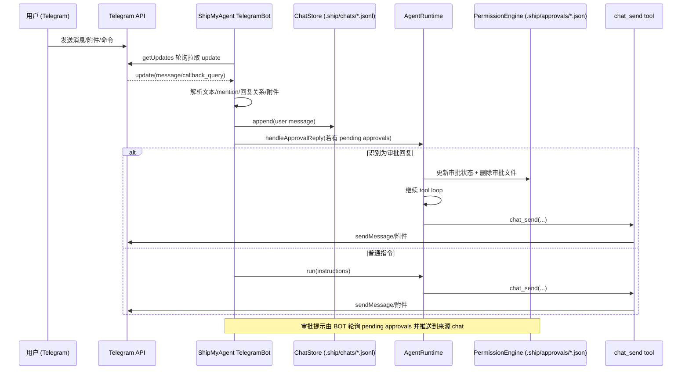

# Telegram：从发消息到收到回复的全链路

这篇文档以 Telegram 为例，说明 **一条用户消息如何进入 ShipMyAgent**，以及 **AgentRuntime 如何执行、如何产生审批、以及消息如何通过 `chat_send` tool 发送回 Telegram**。

> 代码参考：`package/src/adapters/telegram/bot.ts`、`package/src/adapters/base-chat-adapter.ts`、`package/src/runtime/agent/runtime.ts`、`package/src/runtime/permission/*`、`package/src/runtime/chat/*`

## 1）总体流程（概览）



## 2）输入：Telegram update → “可执行指令”

### 2.1 拉取与分发

- ShipMyAgent 以 **轮询** 模式工作：定时调用 `getUpdates` 拉取 `TelegramUpdate[]`，并更新 `lastUpdateId`（持久化在 `.ship/.cache/telegram/lastUpdateId.json`）。
- 每个 update 会按并发上限处理；同时对**同一个 chatKey**做串行化（避免并发把上下文打乱）。

### 2.2 ChatKey（唯一隔离 key）

ShipMyAgent 会把 Telegram 的聊天抽象为一个 **chatKey**，用来隔离上下文与日志：

- 私聊 / 普通群聊：`telegram:chat:<chatId>`
- Topics（话题）的群：`telegram:chat:<chatId>:topic:<messageThreadId>`

### 2.3 群聊里哪些消息会被处理（mention / reply / follow-up window）

在群聊/超级群中，默认不会“监听所有人所有消息”，而是需要满足下列条件之一：

- **显式触发**：`@bot ...`（mention），或**回复 bot 的消息**（reply-to-bot）
- **跟进窗口**：当你刚刚显式触发过一轮对话，后续短时间内的追问可不再 `@`（follow-up window）

此外还有一层 **可对话人限制（groupAccess）**：

- 默认：仅“该 thread 的发起人（第一个和 bot 说话的人）”或“群管理员”可以继续对话
- 可配置为 `"anyone"`：允许任何群成员对话

发起人信息会写入 `.ship/.cache/telegram/threadInitiators.json`，用 chatKey 作为 key。

### 2.4 附件处理：保存到本地缓存 + 注入 `@attach`

当 message 含附件（document/photo/voice/audio）时，ShipMyAgent 会：

1. 调用 `getFile` 获得 `file_path`，再下载文件内容
2. 写入本地缓存目录：`.ship/.cache/telegram/`
3. 在最终指令文本前拼一段 `@attach ...` 行（相对 `projectRoot` 的路径）

示例（最终送入 AgentRuntime 的 instructions）：

```text
@attach document .ship/.cache/telegram/1738...-xxx.pdf | xxx.pdf

帮我总结这个 PDF，并列出待办事项。
```

> 说明：如果用户在发送文件时写了 caption，caption 会作为“文本指令”的来源（与纯 text 同等对待）。

## 3）持久化：ChatStore 如何记录上下文

每次收到用户消息，TelegramBot 都会先写入一条聊天日志（append-only）：

- 路径：`.ship/chats/<encode(chatKey)>.jsonl`
- 格式：`ChatLogEntryV1`（包含 channel/chatId/chatKey/userId/messageId/role/text/meta 等）

在真正执行之前，会从该文件里加载最近 N 条记录，然后把历史**折叠为一条“assistant 压缩上下文”**，再注入到该 chatKey 对应的 AgentRuntime 对话历史里（减少 token/成本，并保持可追溯）。

## 4）执行：AgentRuntime 如何跑起来（sync / async）

### 4.1 先尝试把输入当作“审批回复”

如果该 chatKey 存在 pending approvals，TelegramBot 会优先调用：

- `agentRuntime.handleApprovalReply({ userMessage: instructions, chatKey, context })`

这一步会让模型把用户的自然语言（如“可以”“拒绝，因为…”“全部同意”）映射为对哪些 approval id 的 `approve/refuse/pass` 决策。

如果识别为审批回复并成功处理，会直接返回输出，不再走“普通指令执行”分支。

### 4.1.1 tool-strict：由 Agent 主动发消息

ShipMyAgent 的聊天集成采用 tool-strict：

- Agent 通过 `chat_send` 工具把回复发送回 Telegram（可以分多条、按阶段发送）
- 集成本身不再“自动转发 Agent 的输出”为消息（避免把发送逻辑写死在集成层）

### 4.2 执行与回复（run + delivery）

如果不是审批回复，TelegramBot 会直接调用：

- `agentRuntime.run({ instructions, context })`

回复发送遵循 tool-strict：

- **主要路径**：Agent 使用 `chat_send` 工具把消息发送回 Telegram（可以分多条/分阶段）
- **兜底路径**：如果 Agent 忘记调用 `chat_send`，集成会把最终的 plain text `output` 回发（避免“用户收不到回复”）

发送消息时会：

- 按 3900 字符分片（避开 Telegram 4096 限制）
- 优先用 `parse_mode=Markdown`，失败则回退纯文本
- 解析输出中的 `@attach ...` 并以真正的 Telegram 附件形式发送（支持本地路径或 URL）

### 4.3 后台 runs（可选）

ShipMyAgent 会把 runs 记录落盘在 `.ship/runs/`。部分集成可以基于这些记录实现“完成通知”；当前 Telegram 集成主要处理 tool-driven 回复与审批通知。

## 5）审批：从“工具调用需要确认”到“继续执行”

当 Agent 触发敏感工具（例如写文件、执行 shell）且策略要求审批时：

1. PermissionEngine 创建一条 approval request（落盘在 `.ship/approvals/<id>.json`），并附带 `meta`（例如 `source=telegram`、`userId=chatId`、`chatKey`、`initiatorId` 等）
2. TelegramBot 定时轮询 `getPendingApprovals()`，把待审批操作推送回“来源 chat”
3. 用户可以用两种方式响应：
   - 自然语言回复（走 `handleApprovalReply` 自动路由）
   - 显式命令或按钮（例如 `/approve <id>`、inline keyboard approve/reject）
4. AgentRuntime 在 `resumeFromApprovalActions()` 中：
   - 从 approval 文件里取出 snapshot messages，恢复当时的上下文
   - 将审批结果写成 `ToolApprovalResponse` 注入 tool loop
   - 更新并删除 approval request 文件（`.ship/approvals/<id>.json`）
   - 继续执行并产出新的输出

## 6）用户可能收到的“各种消息”

以一次完整交互为例，用户可能看到：

- **普通回复**：最终答案（可能分片多条；主要来自 `chat_send`，兜底来自 `output` 回发）
- **进度消息**：仅当 Agent 主动用 `chat_send` 发送阶段性进度时才会出现（集成层不做自动“流式转发”）
- **审批提示**：提醒你确认某个敏感操作（并引导如何回复）
- **审批处理结果**：你同意/拒绝后，继续执行并返回后续结果
- **后台 Run 的 ACK / 完成通知（可选）**：取决于集成是否启用后台 runs 与通知逻辑
